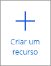
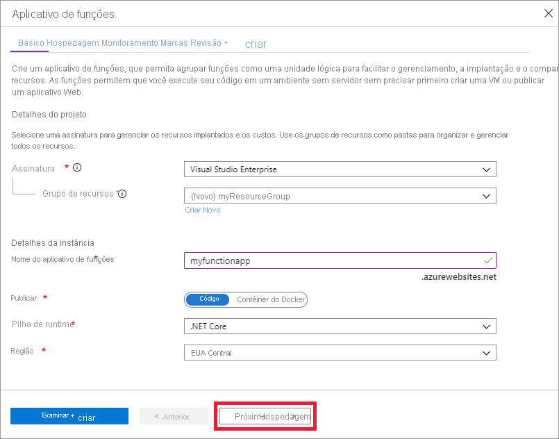
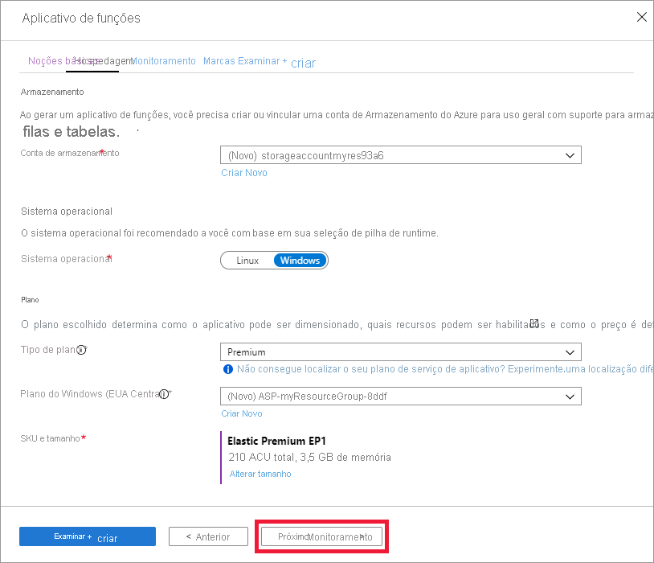
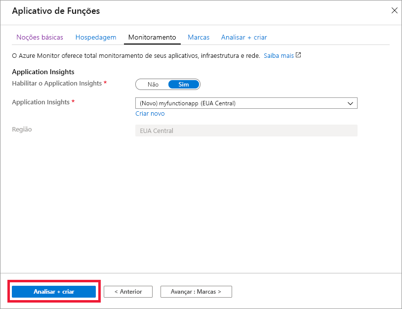

1. Abrir o portal do Azure de [https://portal.azure.com](https://portal.azure.com)

1. Selecione o botão **criar um recurso**

    

1. Selecione > de **computação** **aplicativo de funções**.

    

1. Use as configurações do aplicativo de funções especificadas na tabela abaixo da imagem.

    

    | Configuração      | Valor sugerido  | Descrição |
    | ------------ | ---------------- | ----------- |
    | **Assinatura** | Sua assinatura | A assinatura na qual este novo aplicativo de funções será criado. |
    | **[Grupo de Recursos](../articles/azure-resource-manager/resource-group-overview.md)** |  *myResourceGroup* | Nome do novo grupo de recursos no qual criar o seu aplicativo de funções. |
    | **Nome do Aplicativo de funções** | Nome globalmente exclusivo | Nome que identifica seu novo aplicativo de funções. Os caracteres válidos são `a-z` (não diferencia maiúsculas de minúsculas), `0-9`e `-`.  |
    |**Publicar**| Codificar | Opção para publicar arquivos de código ou um contêiner do Docker. |
    | **Pilha de tempo de execução** | Linguagem preferencial | Escolha um tempo de execução compatível com sua linguagem de programação de funções favorita. Escolha **.NET** para funções C# e F#. |
    |**Região**| Região preferida | Escolha uma [região](https://azure.microsoft.com/regions/) perto de você ou perto de outros serviços que suas funções acessam. |

    Selecione o botão **Avançar: hospedagem >** .

1. Insira as seguintes configurações de hospedagem.

    

    | Configuração      | Valor sugerido  | Descrição |
    | ------------ | ---------------- | ----------- |
    | **[Conta de armazenamento](../articles/storage/common/storage-quickstart-create-account.md)** |  Nome globalmente exclusivo |  Crie uma conta de armazenamento usada pelo seu aplicativo de funções. Os nomes da conta de armazenamento devem ter entre 3 e 24 caracteres e podem conter apenas números e letras minúsculas. Você também pode usar uma conta existente, que deve atender aos [requisitos da conta de armazenamento](../articles/azure-functions/functions-scale.md#storage-account-requirements). |
    |**Sistema operacional**| Sistema operacional preferencial | Um sistema operacional é previamente selecionado para você com base em sua seleção de pilha de tempo de execução, mas você pode alterar a configuração, se necessário. |
    | **[Intenção](../articles/azure-functions/functions-scale.md)** | Premium | Para tipo de plano, selecione **Premium (visualização)** e selecione padrões para as seleções de plano e *SKU e tamanho* do *Windows* . |

    Selecione o botão **Avançar: monitoramento >** .

1. Insira as configurações de monitoramento a seguir.

    

    | Configuração      | Valor sugerido  | Descrição |
    | ------------ | ---------------- | ----------- |
    | **[Application Insights](../articles/azure-functions/functions-monitoring.md)** | Padrão | Cria um recurso do Application Insights do mesmo *nome do aplicativo* na região com suporte mais próxima. Ao expandir essa configuração, você pode alterar o **Novo nome do recurso** ou escolher um **Local** diferente em uma [geografia do Azure](https://azure.microsoft.com/global-infrastructure/geographies/) onde deseja armazenar seus dados. |

    Selecione **examinar + criar** para revisar as seleções de configuração de aplicativo.

1. Selecione **Criar** para provisionar e implantar o aplicativo de funções.