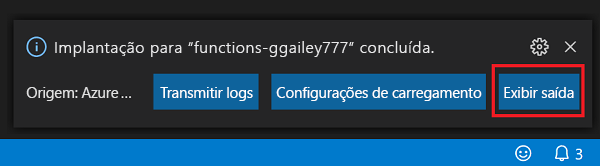

## Publicar o projeto no Azure

Nesta seção, você criará um aplicativo de funções e os recursos relacionados em sua assinatura do Azure e, em seguida, implantará seu código.

> [!IMPORTANT]
> Publicar em um aplicativo de funções existente substitui o conteúdo desse aplicativo no Azure.

1. Escolha o ícone do Azure na Barra de atividade e, em seguida, na área **Azure: Functions**, escolha o botão **Implantar no aplicativo de funções...** .

    

1. Forneça as seguintes informações nos prompts:

    - **Selecione a pasta**: escolha uma pasta do seu workspace ou navegue até uma que contenha seu aplicativo de funções. Você não verá isso se já tiver um aplicativo de funções válido aberto.

    - **Selecione a assinatura**: Escolha a assinatura a ser usada. Essa opção não será exibida caso você possua apenas uma assinatura.

    - **Selecione o aplicativo de funções no Azure**: Escolha `- Create new Function App`. (Não escolha a opção `Advanced`, que não é abordada neste artigo.)
      
    - **Insira um nome exclusivo globalmente para o aplicativo de funções**: Digite um nome que seja válido em um caminho de URL. O nome que você digitar é validado para ter certeza de que ele é exclusivo no Azure Functions.
    
    - **Selecione uma localização para novos recursos**:  Para obter um melhor desempenho, escolha uma [região](https://azure.microsoft.com/regions/) perto de você. 
    
    A extensão mostra o status de recursos individuais conforme eles são criados no Azure na área de notificação.

    :::image type="content" source="media/functions-publish-project-vscode/resource-notification.png" alt-text="Notificação de criação de recurso do Azure":::
    
1.  Quando concluído, os seguintes recursos do Azure serão criados em sua assinatura, usando nomes baseados em seu nome do aplicativo de funções:
    
    [!INCLUDE [functions-vs-code-created-resources](functions-vs-code-created-resources.md)]

    Uma notificação é exibida depois que seu aplicativo de funções é criado e o pacote de implantação é aplicado. 

    [!INCLUDE [functions-vs-code-create-tip](functions-vs-code-create-tip.md)]

4. Escolha **Exibir Saída** nessa notificação para exibir a criação e os resultados da implantação, incluindo os recursos do Azure que você criou. Se você perder a notificação, selecione o ícone de sino no canto inferior direito para vê-lo novamente.

    
