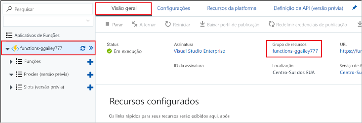

1. No portal do Azure, vá até a página **Grupo de recursos**. 

   Para ir até essa página a partir da página de aplicativo de funções, selecione a guia **Visão geral** e depois selecione o link em **Grupo de recursos**.

   

   Para acessar essa página no painel, selecione **Grupos de recursos**, depois o grupo de recursos usado para este artigo.

2. Na página **Grupo de recursos**, examine a lista de recursos incluídos e verifique se eles são aqueles que deseja excluir.
 
3. Selecione **Excluir grupo de recursos** e siga as instruções.

   A exclusão poderá levar alguns minutos. Ao ser concluída, uma notificação será exibida por alguns segundos. Também é possível selecionar o ícone de sino na parte superior da página para exibir a notificação.