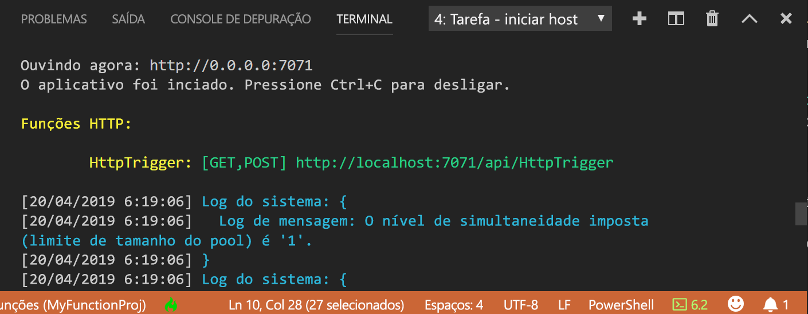
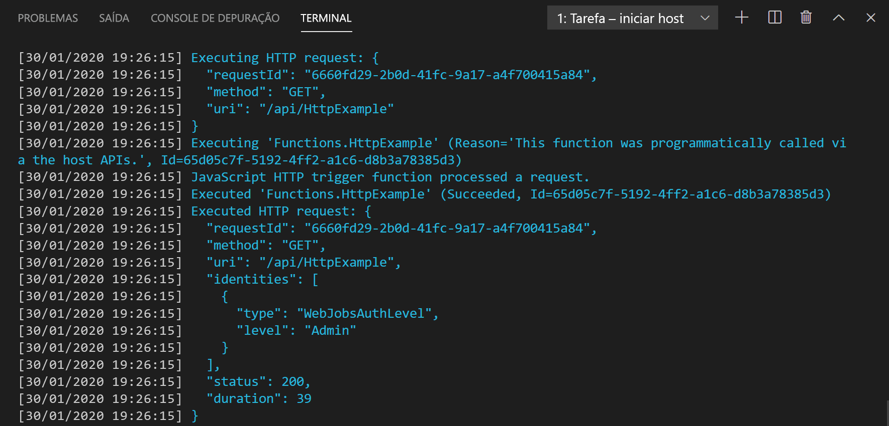

## <a name="run-the-function-locally"></a>Executar a função localmente

O Azure Functions Core Tools é integrado ao Visual Studio Code para permitir que você execute e depure um projeto do Azure Functions localmente.  

1. Para depurar a função, insira uma chamada ao cmdlet [`Wait-Debugger`](/powershell/module/microsoft.powershell.utility/wait-debugger?view=powershell-6) no código da função antes de anexar o depurador e, em seguida, pressione F5 para iniciar o projeto de aplicativo de funções e anexar o depurador. A saída do Core Tools é exibida no painel **Terminal**.

1. No painel **Terminal**, copie o ponto de extremidade de URL da sua função disparada por HTTP.

    

1. Acrescente a cadeia de caracteres de consulta `?name=<yourname>` a esta URL e, em seguida, use `Invoke-RestMethod` em um segundo prompt de comando do PowerShell para executar a solicitação, da seguinte maneira:

    ```powershell
    PS > Invoke-RestMethod -Method Get -Uri http://localhost:7071/api/HttpTrigger?name=PowerShell
    Hello PowerShell
    ```

    Você também pode executar a solicitação GET em um navegador com base na seguinte URL:

    <http://localhost:7071/api/HttpExample?name=PowerShell>

    Quando você chama o ponto de extremidade do HttpTrigger sem passar um parâmetro `name` como um parâmetro de consulta ou no corpo, a função retorna um erro `BadRequest`. Quando você examinar o código em run.ps1, verá que esse erro ocorre por design.

1. As informações sobre a solicitação são mostradas no painel **Terminal**.

    

1. Para parar a depuração, pressione Ctrl + C para parar o Core Tools.

Após verificar se a função foi executada corretamente no computador local, é hora de publicar o projeto no Azure.

> [!NOTE]
> Lembre-se de remover todas as chamadas a `Wait-Debugger` antes de publicar suas funções no Azure. 