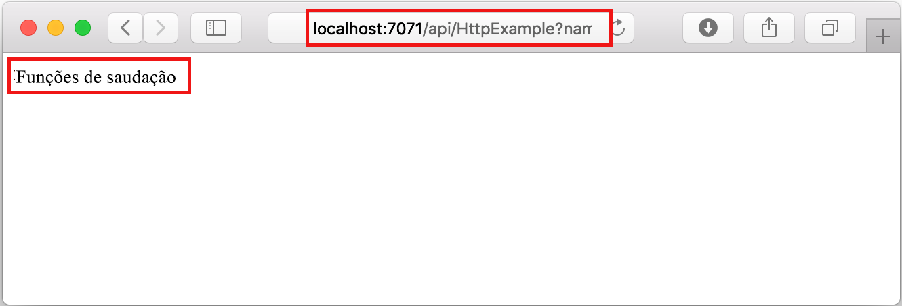

## Executar a função localmente

O Visual Studio Code integra-se ao [Azure Functions Core Tools](../articles/azure-functions/functions-run-local.md) para permitir que você execute esse projeto em seu computador de desenvolvimento local antes de publicar no Azure.

1. Para chamar sua função, pressione F5 para iniciar o projeto de aplicativo de funções. A saída do Core Tools é exibida no painel **Terminal**.

1. Se ainda não tiver instalado o Azure Functions Core Tools, selecione **Instalar** no prompt. Quando o Core Tools for instalado, seu aplicativo será iniciado no painel **Terminal**. Você pode ver o ponto de extremidade de URL de sua função disparada por HTTP localmente. 

    

1. Com o Core Tools em execução, navegue até a URL a seguir para executar uma solicitação GET, que inclui a cadeia de caracteres de consulta `?name=Functions`.

    <http://localhost:7071/api/HttpExample?name=Functions>

1. Uma resposta é retornada, semelhante ao seguinte em um navegador:

    

1. As informações sobre a solicitação são mostradas no painel **Terminal**.

    

1. Pressione Ctrl + C para parar o Core Tools e desconectar o depurador.
