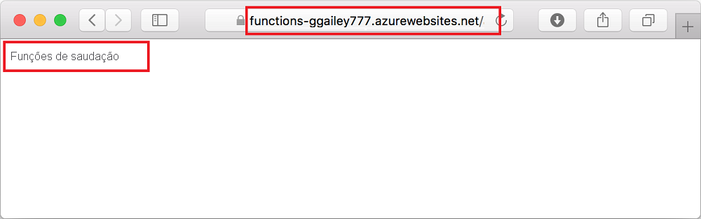

## <a name="run-the-function-in-azure"></a>Executar a função no Azure

1. De volta na área **Azure: Functions** na barra lateral, expanda o novo aplicativo de funções em sua assinatura. Expanda **Funções** , clique com o botão direito do mouse (Windows) ou pressione <kbd>Ctrl</kbd> e clique (macOS) em **HttpExample** e escolha **Copiar URL de função**.

    

1. Cole essa URL para a solicitação HTTP na barra de endereços do navegador, adicione a cadeia de caracteres de consulta `name` como `?name=Functions` no final desta URL e, em seguida, execute a solicitação. A URL que chama a função HTTP disparada deve estar no seguinte formato:

    ```http
    http://<FUNCTION_APP_NAME>.azurewebsites.net/api/httpexample?name=Functions
    ```

    O seguinte exemplo mostra a resposta no navegador à solicitação GET remota retornada pela função:

    
