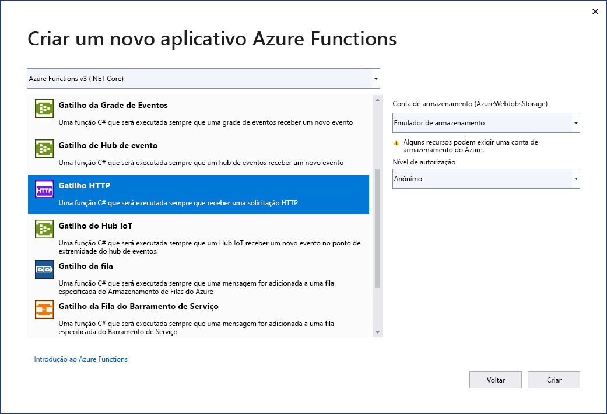

O modelo de projeto do Azure Functions no Visual Studio cria um projeto que você pode publicar em um aplicativo de funções no Azure. Você pode usar um aplicativo de funções para agrupar funções como uma unidade lógica para facilitar o gerenciamento, a implantação, o dimensionamento e o compartilhamento de recursos.

1. No menu do Visual Studio, selecione **Arquivo** > **Novo** > **Projeto**.

1. Em **Criar um projeto**, insira *funções* na caixa de pesquisa, escolha o modelo **Azure Functions** e, em seguida, selecione **Próximo**.

1. Em **Configurar seu novo projeto**, insira um **Nome de projeto** para seu projeto e, em seguida, selecione **Criar**. O nome do aplicativo de funções deve ser válido como um namespace do C# e, portanto, não use outros caracteres não alfanuméricos, hífens ou sublinhados.

1. Para as configurações de **Criar um aplicativo do Azure Functions**, use os valores da tabela a seguir:

    | Configuração      | Valor  | Descrição                      |
    | ------------ |  ------- |----------------------------------------- |
    | **Runtime do Functions** | **Azure Functions v3  (.NET Core)** | Esse valor cria um projeto de função que usa o runtime versão 3.x do Azure Functions, compatível com o .NET Core 3.x. O Azure Functions 1.x dá suporte ao .NET Framework. Para obter mais informações, consulte [Visão geral de versões do Azure Functions runtime](../articles/azure-functions/functions-versions.md).   |
    | **Modelo de função** | **Gatilho HTTP** | Esse valor cria uma função acionada por uma solicitação HTTP. |
    | **Conta de armazenamento (AzureWebJobsStorage)**  | **Emulador de armazenamento** | Como Uma Função do Azure requer uma conta de armazenamento, uma será atribuída ou criada quando você publicar seu projeto no Azure. Um gatilho HTTP não usa uma cadeia de conexão da conta do Armazenamento do Azure; todos os outros tipos de gatilho exigem uma cadeia de conexão válida da conta do Armazenamento do Azure.  |
    | **Nível de autorização** | **Anônimo** | A função criada pode ser acionada por qualquer cliente sem fornecer uma chave. Essa configuração de autorização torna fácil testar a nova função. Para obter mais informações sobre chaves e autorização, consulte [Chaves de autorização](../articles/azure-functions/functions-bindings-http-webhook-trigger.md#authorization-keys) e [associações HTTP e webhook](../articles/azure-functions/functions-bindings-http-webhook.md). |
    
    
    

    Verifique se você definiu o **Nível de autorização** como **Anônimo**. Se você escolher o nível padrão da **Função**, será necessário que você apresente a [chave da função](../articles/azure-functions/functions-bindings-http-webhook-trigger.md#authorization-keys) em solicitações para acessar seu ponto de extremidade da função.

1. Selecione **Criar** para criar o projeto de função e a função de gatilho HTTP.
