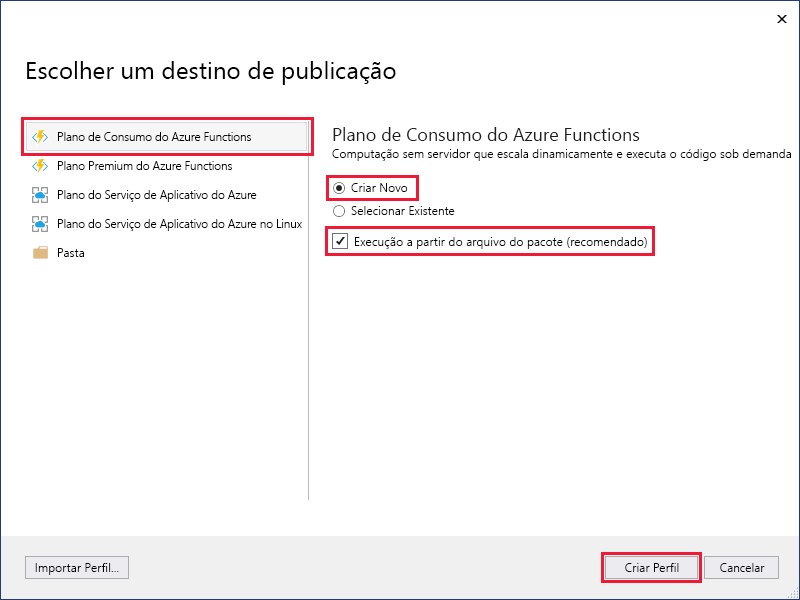
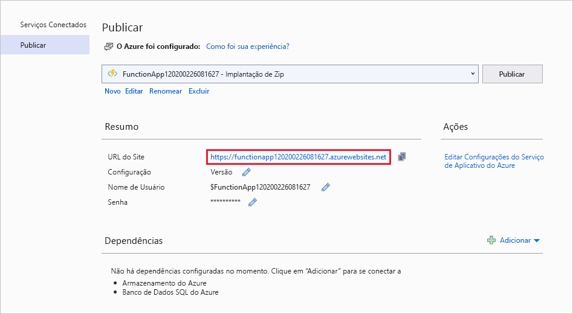

1. No **Gerenciador de Soluções**, clique com o botão direito do mouse no nome do projeto e selecione **Publicar**.

2. Em **Escolher um destino de publicação**, use as opções de publicação especificadas na seguinte tabela: 

    | Opção      | Descrição                                |
    | ------------ |  -------------------------------------------------- |
    | **Plano de consumo do Azure Functions** | Crie um aplicativo de funções em um ambiente de nuvem do Azure que seja executado em um [Plano de consumo](../articles/azure-functions/functions-scale.md#consumption-plan). Ao usar esse plano, você paga apenas pelas execuções do aplicativo de funções. Outros planos de hospedagem incorrem em custos mais altos. Caso execute em um plano que não seja de consumo, você deve gerenciar o [dimensionamento do aplicativo de funções](../articles/azure-functions/functions-scale.md).| 
    | **Criar** | Um novo aplicativo de funções com recursos relacionados é criado no Azure.  Se você escolhe **selecionar existente**, todos os arquivos no aplicativo de funções existente no Azure são substituídos pelos arquivos do projeto local. Use essa opção somente quando republicar atualizações para um aplicativo de funções existente. |
    | **Executar com base no arquivo de pacote** | Seu aplicativo de funções é implantado usando a [Implantação de Zip](../articles/azure-functions/functions-deployment-technologies.md#zip-deploy) com o modo [Run-From-Package](../articles/azure-functions/run-functions-from-deployment-package.md) habilitado. Essa implantação, que resulta em um melhor desempenho, é a maneira recomendada de executar suas funções.  Se você não usar essa opção, interrompa a execução local do projeto de aplicativo de funções antes de publicar no Azure. |

    

3. Selecione **Criar Perfil**. Se você ainda não entrou em sua conta do Azure do Visual Studio, selecione **Entrar**. Também é possível criar uma conta gratuita do Azure.

4. No **Serviço de Aplicativo: Crie novo**, use os valores especificados na seguinte tabela:

    | Configuração      | Valor  | Descrição                                |
    | ------------ |  ------- | -------------------------------------------------- |
    | **Nome** | Nome globalmente exclusivo | Nome que identifica seu novo aplicativo de funções de forma exclusiva. Aceite esse nome ou insira um novo nome. Os caracteres válidos são: `a-z`, `0-9` e `-`. |
    | **Assinatura** | Sua assinatura | A assinatura do Azure a utilizar. Aceite esta assinatura ou selecione uma nova na lista suspensa. |
    | **[Grupo de recursos](../articles/azure-resource-manager/management/overview.md)** | Nome do seu grupo de recursos |  O grupo de recursos no qual criar o seu aplicativo de funções. Selecione um grupo de recursos existente na lista suspensa ou escolha **Novo** para criar um grupo de recursos.|
    | **[Plano de hospedagem](../articles/azure-functions/functions-scale.md)** | Nome do seu plano de hospedagem | Selecione **Novo** para configurar um plano sem servidor. Não se esqueça de escolher o **Consumo** em **Tamanho**. Quando você publica seu projeto em um aplicativo de funções executado em um [Plano de consumo](../articles/azure-functions/functions-scale.md#consumption-plan), você paga apenas pelas execuções do seu aplicativo de funções. Outros planos de hospedagem incorrem em custos mais altos. Se você executa em um plano diferente do **Consumo**, deve gerenciar o [dimensionamento de seu aplicativo de funções](../articles/azure-functions/functions-scale.md).  |
    | **Localidade** | Local do serviço de aplicativo | Escolha um **Local** em uma [região](https://azure.microsoft.com/regions/) perto de você ou de outros serviços acessados pelas suas funções. |
    | **[Armazenamento do Azure](../articles/storage/common/storage-account-create.md)** | Conta de armazenamento para uso geral | Uma conta do Armazenamento do Azure é requerida pelo runtime do Functions. Selecione **Novo** para configurar uma conta de armazenamento para uso geral. Você também pode escolher uma conta existente que atenda aos [requisitos da conta de armazenamento](../articles/azure-functions/functions-scale.md#storage-account-requirements).  |

    

5. Selecione **Criar** para criar um aplicativo de funções e os recursos relacionados no Azure com essas configurações e implantar seu código de projeto de função. 

6. Selecione Publicar e após a conclusão da implantação, anote o valor da **URL do Site**, que é o endereço do seu aplicativo de funções no Azure.

    
