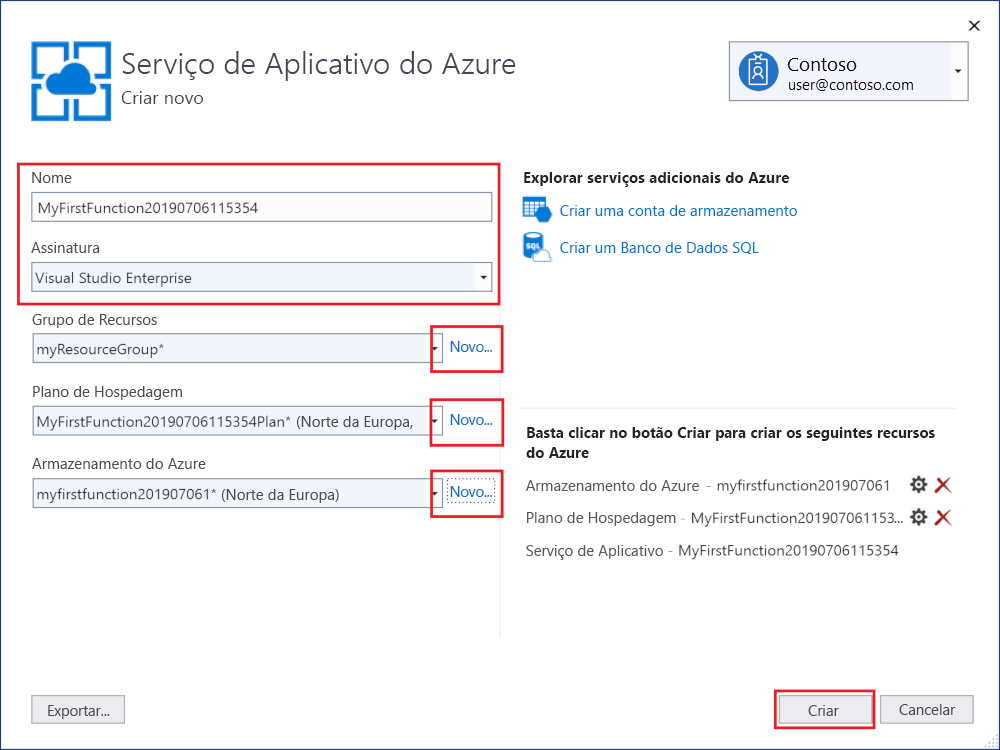

1. No **Gerenciador de Soluções**, clique com o botão direito do mouse no projeto e selecione **Publicar**. Depois, em **Destino**, selecione **Azure** e **Avançar**.

1. Para o **Destino específico**, escolha o **Aplicativo de Funções do Azure (Windows)** , que cria um aplicativo de funções executado no Windows.

1. Em **Instância de Função**, escolha **Criar uma função do Azure...** 

    :::image type="content" source="media/functions-vstools-publish/functions-visual-studio-publish-new-resource.png" alt-text="Criar uma instância de aplicativo de funções":::

1. Crie uma instância usando os valores especificados nesta tabela:

    | Configuração      | Valor  | Descrição                                |
    | ------------ |  ------- | -------------------------------------------------- |
    | **Nome** | Nome globalmente exclusivo | Nome que identifica seu novo aplicativo de funções de forma exclusiva. Aceite esse nome ou insira um novo nome. Os caracteres válidos são: `a-z`, `0-9` e `-`. |
    | **Assinatura** | Sua assinatura | A assinatura do Azure a utilizar. Aceite esta assinatura ou selecione uma nova na lista suspensa. |
    | **[Grupo de recursos](../articles/azure-resource-manager/management/overview.md)** | Nome do seu grupo de recursos |  O grupo de recursos no qual criar o seu aplicativo de funções. Selecione um grupo de recursos existente na lista suspensa ou escolha **Novo** para criar um grupo de recursos.|
    | **[Tipo de Plano](../articles/azure-functions/functions-scale.md)** | Consumo | Quando você publica seu projeto em um aplicativo de funções executado em um [Plano de consumo](../articles/azure-functions/consumption-plan.md), você paga apenas pelas execuções do seu aplicativo de funções. Outros planos de hospedagem incorrem em custos mais altos. |
    | **Localidade** | Local do serviço de aplicativo | Escolha um **Local** em uma [região](https://azure.microsoft.com/regions/) perto de você ou de outros serviços acessados pelas suas funções. |
    | **[Armazenamento do Azure](../articles/azure-functions/storage-considerations.md)** | Conta de armazenamento para uso geral | Uma conta do Armazenamento do Azure é requerida pelo runtime do Functions. Selecione **Novo** para configurar uma conta de armazenamento para uso geral. Você também pode escolher uma conta existente que atenda aos [requisitos da conta de armazenamento](../articles/azure-functions/storage-considerations.md#storage-account-requirements).  |

    

1. Selecione **Criar** para criar um aplicativo de funções e recursos relacionados no Azure. O status da criação do recurso é mostrado na parte inferior esquerda da janela. 

1. Na **Instância do Functions**, verifique se **Executar no arquivo do pacote** está marcado. Seu aplicativo de funções é implantado usando a [Implantação de Zip](../articles/azure-functions/functions-deployment-technologies.md#zip-deploy) com o modo [Run-From-Package](../articles/azure-functions/run-functions-from-deployment-package.md) habilitado. Esse é o método de implantação recomendado para o seu projeto do Functions, pois ele resulta em um melhor desempenho. 

    :::image type="content" source="media/functions-vstools-publish/functions-visual-studio-publish-profile-step-4.png" alt-text="Concluir a criação do perfil":::

1. Selecione **Concluir** e, na página Publicar, selecione **Publicar** para implantar o pacote que contém os arquivos do projeto no seu novo aplicativo de funções no Azure. 

    Após a conclusão da implantação, a URL raiz do aplicativo de funções no Azure é mostrada na guia **Publicar**. 
    
1.  Na guia Publicar, escolha **Gerenciar no Cloud Explorer**. Isso abre o novo recurso do Azure do aplicativo de funções no Cloud Explorer. 
    
    :::image type="content" source="media/functions-vstools-publish/functions-visual-studio-publish-complete.png" alt-text="Publicar mensagem de êxito":::
    
    O Cloud Explorer permite que você use o Visual Studio para exibir o conteúdo do site, iniciar e parar o aplicativo de funções e navegar diretamente para recursos do aplicativo de funções no Azure e no portal do Azure. 
