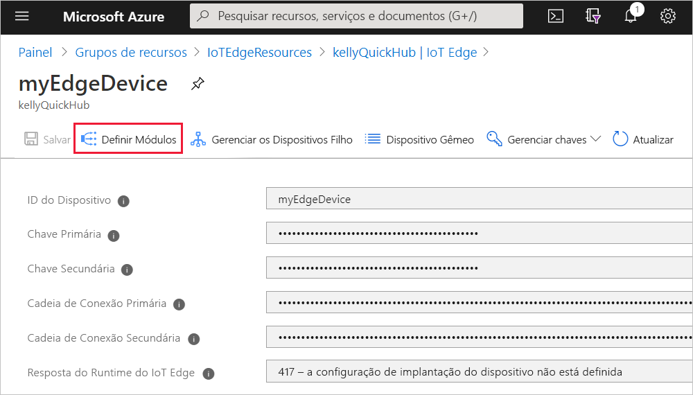
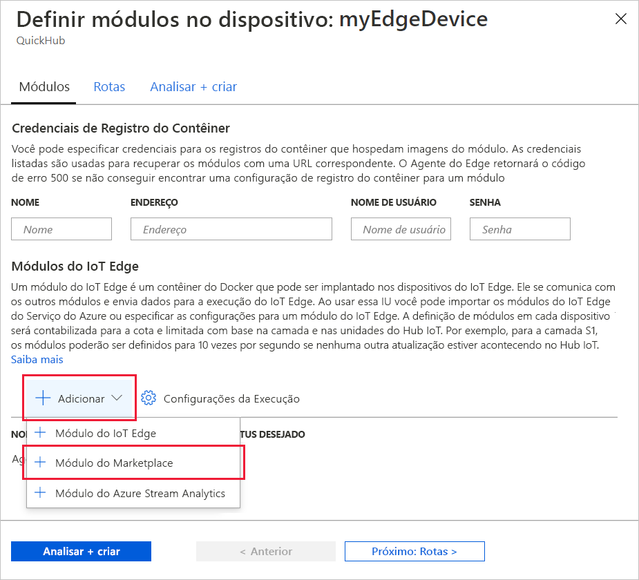
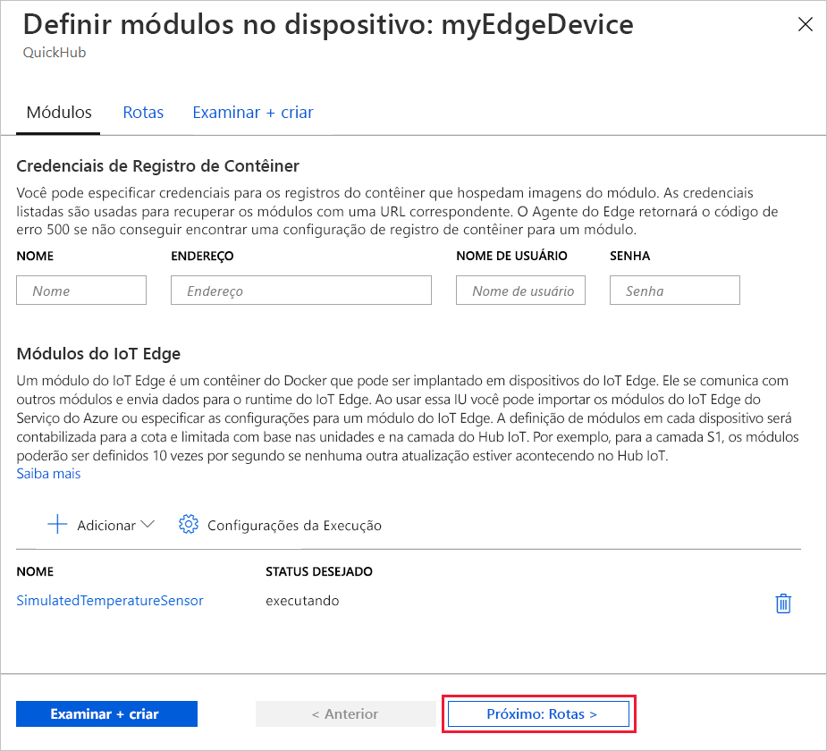
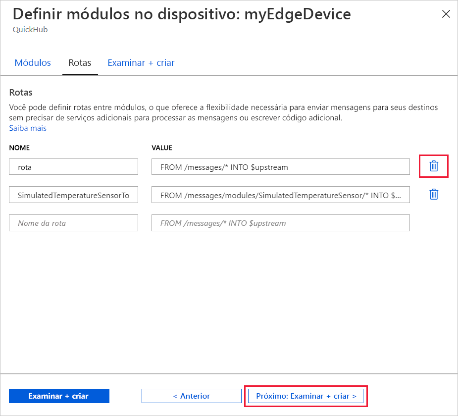

Uma das principais funcionalidades do Azure IoT Edge é a implantação do código nos seus dispositivos IoT Edge por meio da nuvem. *Módulos do IoT Edge* são pacotes executáveis implementados como contêineres. Nesta seção, você implantará um módulo predefinido na [seção Módulos do IoT Edge do Azure Marketplace](https://azuremarketplace.microsoft.com/marketplace/apps/category/internet-of-things?page=1&subcategories=iot-edge-modules) diretamente no Hub IoT do Azure.

O módulo que você implanta nesta seção simula um sensor e envia os dados gerados. Esse módulo é uma informação útil de código quando você estiver começando a usar o IoT Edge porque você pode usar os dados simulados para desenvolvimento e teste. Se quiser ver exatamente o que esse módulo faz, você poderá exibir o [código-fonte do sensor de temperatura simulado](https://github.com/Azure/iotedge/blob/027a509549a248647ed41ca7fe1dc508771c8123/edge-modules/SimulatedTemperatureSensor/src/Program.cs).

Siga estas etapas para implantar seu primeiro módulo do Azure Marketplace.

1. Entre no [portal do Azure](https://portal.azure.com) e acesse seu hub IoT.

1. No menu à esquerda, em **Gerenciamento Automático de Dispositivo**, selecione **IoT Edge**.

1. Selecione a identificação do dispositivo de destino da lista de dispositivos.

1. Na barra superior, selecione **Definir Módulos**.

   

1. Em **Módulos do IoT Edge**, abra o menu suspenso **Adicionar** e selecione **Módulo do Marketplace**.

   

1. Em **Marketplace do Módulo do IoT Edge**, procure e selecione o módulo `Simulated Temperature Sensor`.

   O módulo será adicionado à seção Módulos do IoT Edge com o status **em execução** desejado.

1. Selecione **Avançar: Rotas** para prosseguir para a próxima etapa do assistente.

   

1. Na guia **Rotas**, remova a rota padrão, **route**, e selecione **Avançar: Examinar + criar** para continuar e ir para a próxima etapa do assistente.

   >[!Note]
   >As rotas são construídas usando pares de nome e valor. Você verá duas rotas nessa página. A rota padrão, **route**, envia todas as mensagens ao Hub IoT (que é chamado `$upstream`). Uma segunda rota, **SimulatedTemperatureSensorToIoTHub**, foi criada automaticamente quando você adicionou o módulo do Azure Marketplace. Essa rota envia todas as mensagens do módulo de temperatura simulada para o Hub IoT. Você pode excluir a rota padrão porque ela é redundante nesse caso.

   

1. Examine o arquivo JSON e selecione **Criar**. O arquivo JSON define todos os módulos que você implanta no seu dispositivo IoT Edge. Você verá o módulo **SimulatedTemperatureSensor** e os dois módulos de runtime, **edgeAgent** e **edgeHub**.

   >[!Note]
   >Quando você envia uma nova implantação para um dispositivo IoT Edge, nada é enviado por push para o dispositivo. Em vez disso, o dispositivo consulta o Hub IoT regularmente para verificar se há novas instruções. Se o dispositivo encontrar um manifesto de implantação atualizada, ele usará as informações sobre a nova implantação para efetuar pull das imagens de módulo da nuvem e, em seguida, começa a executar os módulos localmente. Esse processo pode levar alguns minutos.

1. Depois que você criar os detalhes de implantação do módulo, o assistente direcionará você à página de detalhes do dispositivo. Veja o status da implantação na guia **Módulos**.

   Você verá três módulos: **$edgeAgent**, **$edgeHub** e **SimulatedTemperatureSensor**. Se um ou mais módulos mostrarem **SIM** em **ESPECIFICADO NA IMPLANTAÇÃO**, mas não em **RELATADO PELO DISPOSITIVO**, isso indicará que o dispositivo IoT Edge ainda está iniciando os módulos. Aguarde alguns minutos e atualize a página.

   
