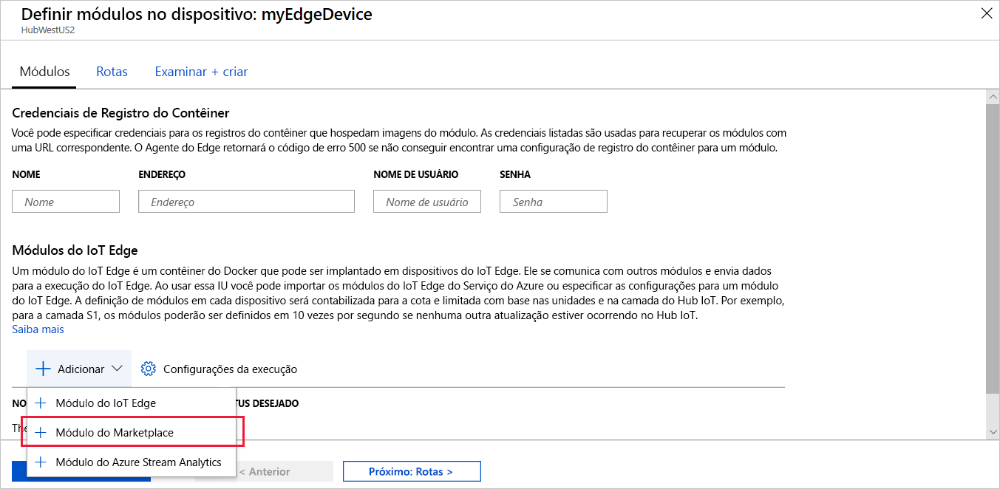
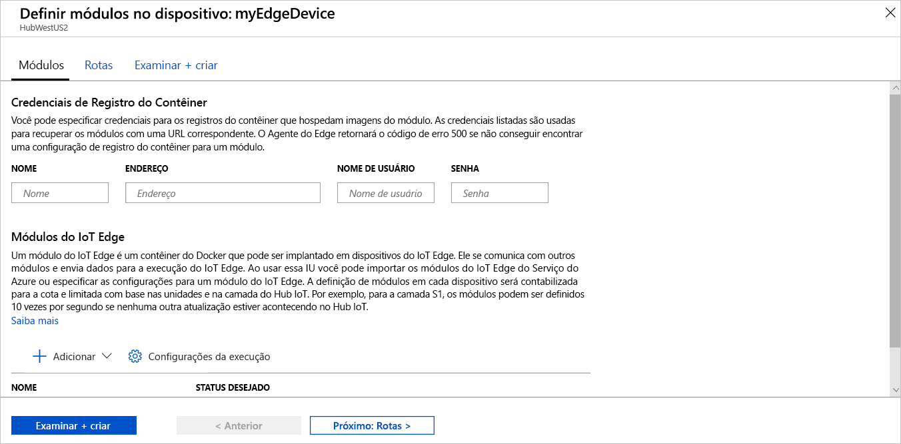

Um dos principais recursos do Azure IoT Edge é a possibilidade de implantar código em seus dispositivos IoT Edge na nuvem. **Módulos do IoT Edge** são pacotes executáveis implementados como contêineres. Nesta seção, você implanta um módulo pré-criado na [seção Módulos do IoT Edge do Azure Marketplace](https://azuremarketplace.microsoft.com/marketplace/apps/category/internet-of-things?page=1&subcategories=iot-edge-modules) diretamente de seu Hub IoT do Azure.

O módulo que você implanta nesta seção simula um sensor e envia os dados gerados. Esse módulo é uma informação útil de código quando você estiver começando a usar o IoT Edge porque você pode usar os dados simulados para desenvolvimento e teste. Se quiser ver exatamente o que esse módulo faz, você poderá exibir o [código-fonte do sensor de temperatura simulado](https://github.com/Azure/iotedge/blob/027a509549a248647ed41ca7fe1dc508771c8123/edge-modules/SimulatedTemperatureSensor/src/Program.cs).

Para implantar seu primeiro módulo do Azure Marketplace, use as seguintes etapas:

1. Entre no [Portal do Azure](https://portal.azure.com) e navegue até o Hub IoT.

1. No menu no painel esquerdo, em **Gerenciamento Automático de Dispositivo**, selecione **IoT Edge**.

1. Clique na ID do dispositivo alvo da lista de dispositivos.

1. Na barra superior, selecione **Definir Módulos**.

1. Na seção **Módulos do IoT Edge** da página, clique em **Adicionar**.

1. No menu suspenso, selecione **Módulo do Marketplace**.

   

1. Em **Marketplace do Módulo do IoT Edge**, pesquise "Sensor de Temperatura Simulado" e selecione esse módulo.

1. Observe que o módulo SimulatedTemperatureSensor é preenchido automaticamente. Nos tutoriais, você usa essa página para adicionar outros módulos à implantação. Para este início rápido, basta implantar esse único módulo. Nenhuma credencial é necessária porque ele é público.

   

   Selecione **Avançar: Rotas** para prosseguir para a próxima etapa do assistente.

1. Na guia **Rotas** do assistente, defina como as mensagens são transmitidas entre os módulos e o Hub IoT. As mensagens são construídas usando pares nome/valor. Para o início rápido, você deseja que todas as mensagens de todos os módulos sejam direcionadas ao Hub IoT (`$upstream`). Se não for preenchido automaticamente, adicione o seguinte código para o **Valor** para o **Nome** `upstream`:

   ```sql
    FROM /messages/* INTO $upstream
   ```

   Selecione **Avançar: Examinar + criar** para continuar e ir para a próxima etapa do assistente.

1. Na guia **Examinar + criar** do assistente, você pode visualizar o arquivo JSON que define todos os módulos implantados no dispositivo IoT Edge. Observe que o módulo **SimulatedTemperatureSensor** está incluído, bem como dois módulos de sistema adicionais chamados **edgeAgent** e **edgeHub**. Selecione **Criar** quando terminar de examinar.

   Quando você envia uma nova implantação para um dispositivo IoT Edge, nada é enviado por push para o dispositivo. Em vez disso, o dispositivo consulta o Hub IoT regularmente para verificar se há novas instruções. Se o dispositivo encontrar um manifesto de implantação atualizada, ele usará as informações sobre a nova implantação para efetuar pull das imagens de módulo da nuvem e, em seguida, começa a executar os módulos localmente. Esse processo pode levar alguns minutos.

1. Depois que você criar os detalhes da implantação de módulo, o assistente direcionará você à página **IoT Edge** do hub IoT. Selecione seu dispositivo na lista de dispositivos IoT Edge para ver os detalhes.

1. Na página de detalhes do dispositivo, role a tela para baixo até a guia **Módulos**. Três módulos deverão estar listados: $edgeAgent, $edgeHub e SimulatedTemperatureSensor. Se um ou mais módulos estão listados conforme especificado na implantação, mas não são relatados pelo dispositivo, o dispositivo IoT Edge ainda está iniciando os módulos. Aguarde alguns instantes e selecione **Atualizar** na parte superior da página.

   
