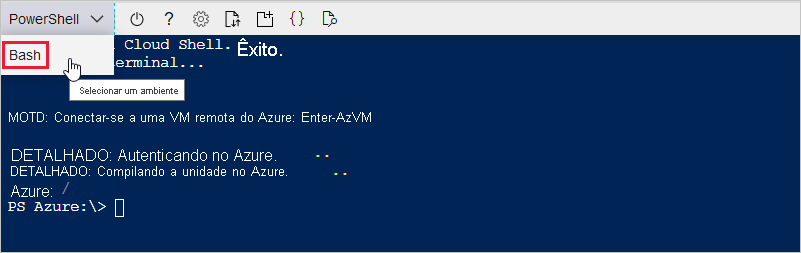

Nas seções a seguir, você configura um terminal e usa a CLI do Azure para criar um hub IoT. Para configurar um terminal que executa comandos da CLI do Azure, você pode usar o Azure Cloud Shell baseado em navegador ou um terminal local.
* Para usar o Cloud Shell, acesse a próxima seção: [Iniciar o Cloud Shell](#launch-the-cloud-shell). 
* Para usar um terminal local, pule a próxima seção e acesse [Abrir um terminal local](#open-a-local-terminal).

## <a name="launch-the-cloud-shell"></a>Iniciar o Cloud Shell
Nessa seção, crie uma sessão do Cloud Shell e configure o ambiente de terminal.

Entre no Portal do Azure em https://portal.azure.com.  

Para iniciar o Cloud Shell:

1. Clique no botão **Cloud Shell** na barra de menus no canto superior direito do portal do Azure. 

    

    > [!NOTE]
    > Se esta for a primeira vez que você usa o Cloud Shell, ele solicitará que você crie o armazenamento, que é necessário para usar o Cloud Shell.  Selecione uma assinatura para criar uma conta de armazenamento e um compartilhamento de Arquivos do Microsoft Azure. 

2. Selecione o ambiente da CLI preferencial no menu suspenso **Selecionar ambiente**. Este guia de início rápido usa o ambiente de **Bash**. Todos os comandos da CLI a seguir também funcionam no ambiente do PowerShell. 

    

3. Ignore a próxima seção e acesse [Instalar a extensão do Azure IoT](#install-the-azure-iot-extension). 

## <a name="open-a-local-terminal"></a>Abrir um terminal local
Se você optar por usar um terminal local em vez do Cloud Shell, conclua esta seção.  

1. Abra um terminal local.
1. Execute o comando [az login](/cli/azure/reference-index#az_login):

   ```azurecli
   az login
   ```

    Se a CLI puder abrir o navegador padrão, ela o fará e carregará uma página de entrada do Azure.

    Caso contrário, abra uma página de navegador em https://aka.ms/devicelogin e insira o código de autorização exibido no terminal.

    Se nenhum navegador da Web estiver disponível ou se não for possível abrir o navegador da Web, use o fluxo de código do dispositivo com `az login --use-device-code`.

1. Entre com suas credenciais de conta no navegador.

    Para saber mais sobre os diferentes métodos de autenticação, confira [Entrar com a CLI do Azure]( /cli/azure/authenticate-azure-cli ).

1. Acesse a próxima seção: [Instalar a extensão do Azure IoT](#install-the-azure-iot-extension). 

## <a name="install-the-azure-iot-extension"></a>Instalar a extensão do Azure IoT
Nesta seção, você instalará a extensão do Microsoft Azure IoT para a CLI do Azure no seu shell da CLI. A Extensão de IoT adiciona comandos específicos do Hub IoT, do IoT Edge e do DPS (Serviço de Provisionamento de Dispositivos IoT) à CLI do Azure.

> [!IMPORTANT]
> Os comandos de terminal no restante deste guia de início rápido funcionam da mesma forma no Cloud Shell ou em um terminal local. Para executar um comando, selecione **Copiar** para copiar um bloco de código neste guia de início rápido. Em seguida, cole-o no shell da CLI e execute-o.

Execute o comando [az extension add](/cli/azure/extension#az-extension-add). 

   ```azurecli
   az extension add --name azure-iot
   ```
[!INCLUDE [iot-hub-cli-version-info](iot-hub-cli-version-info.md)]

## <a name="create-an-iot-hub"></a>Crie um hub IoT
Nesta seção, você usa a CLI do Azure para criar um hub IoT e um grupo de recursos.  Um grupo de recursos do Azure é um contêiner lógico no qual os recursos do Azure são implantados e gerenciados. Um hub IoT atua como um hub central de mensagens para comunicação bidirecional entre o aplicativo IoT e os dispositivos. 

Para criar um hub IoT e um grupo de recursos:

1. Execute o comando [az group create](/cli/azure/group#az-group-create) para criar um grupo de recursos. O comando a seguir cria um grupo de recursos chamado *MyResourceGroup* na localização *eastus*. 
    >[!NOTE]
    > Opcionalmente, você pode definir uma localização alternativa. Para ver os locais disponíveis, execute `az account list-locations`. Este tutorial usa *eastus*, conforme mostrado no comando de exemplo. 

    ```azurecli
    az group create --name MyResourceGroup --location eastus
    ```

1. Execute o comando [az iot hub create](/cli/azure/iot/hub#az-iot-hub-create) para criar um Hub IoT. Pode levar alguns minutos para criar um Hub IoT. 

    *YourIotHubName*. Substitua esse espaço reservado e as chaves ao redor no comando a seguir, usando o nome escolhido para o hub IoT. Um nome de Hub IoT deve ser exclusivo globalmente no Azure. Use o nome do hub IoT no restante deste guia de início rápido, sempre que ver o espaço reservado.

    ```azurecli
    az iot hub create --resource-group MyResourceGroup --name {YourIoTHubName}
    ```

## <a name="create-a-simulated-device"></a>Criar um dispositivo simulado
Nesta seção, você cria um dispositivo IoT simulado que está conectado ao seu hub IoT. 

Para criar um dispositivo simulado:
1. Execute o comando [az iot hub device-identity create](/cli/azure/ext/azure-iot/iot/hub/device-identity#ext-azure-iot-az-iot-hub-device-identity-create) no seu shell da CLI. Isso cria a identidade do dispositivo simulado. 

    *YourIotHubName*. substitua o espaço reservado abaixo pelo nome escolhido para o hub IoT. 

    *myDevice*. Você pode usar esse nome diretamente para a ID do dispositivo simulado no restante deste artigo. Opcionalmente, use outro nome. 

    ```azurecli
    az iot hub device-identity create --device-id myDevice --hub-name {YourIoTHubName} 
    ```

1.  Execute o comando [az iot hub device-identity connection-string show](/cli/azure/ext/azure-iot/iot/hub/device-identity/connection-string#ext_azure_iot_az_iot_hub_device_identity_connection_string_show). 

    ```azurecli
    az iot hub device-identity connection-string show --device-id myDevice --hub-name {YourIoTHubName}
    ```

    A saída da cadeia de conexão está no seguinte formato:

    ```Output
    HostName=<your IoT Hub name>.azure-devices.net;DeviceId=<your device id>;SharedAccessKey=<some value>
    ```

1. Salve a cadeia de conexão em uma localização segura. 

> [!NOTE]
> Mantenha o shell da CLI aberto. Você o usará em etapas posteriores.