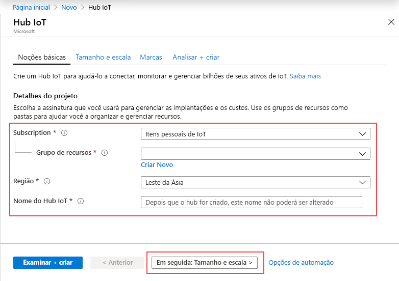
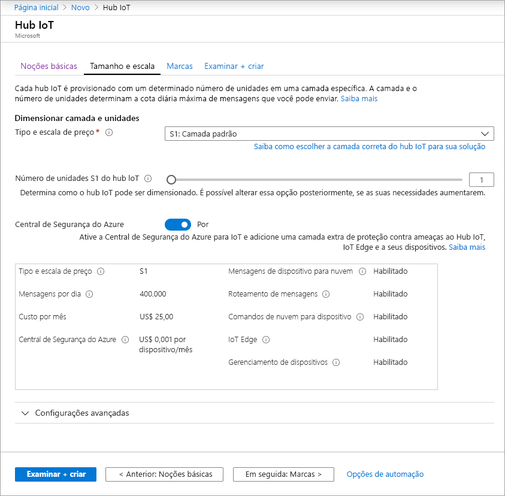
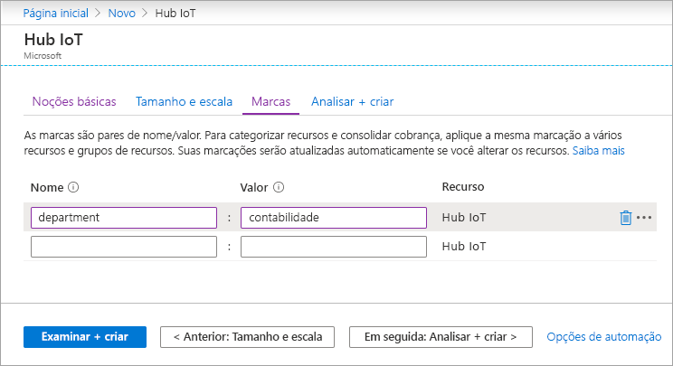
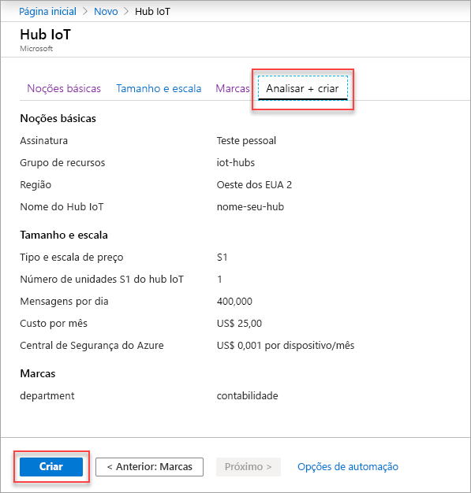

Esta seção descreve como criar um hub IoT usando o [portal do Azure](https://portal.azure.com).

1. Entre no [portal do Azure](https://portal.azure.com).

1. Na página inicial do Azure, selecione o botão **Criar um recurso** e, em seguida, insira *Hub IoT* no campo **Pesquisar no Marketplace**.

1. Selecione **Hub IoT** nos resultados da pesquisa e, em seguida, selecione **Criar**.

1. Na guia **Básico**, preencha os campos da seguinte maneira:

   - **Assinatura**: Selecione a assinatura a ser usada para o hub.

   - **Grupo de Recursos**: Selecione um grupo de recursos ou crie um novo. Para criar um novo, selecione **Criar novo** e preencha o nome que deseja usar. Para usar um grupo de recursos existente, selecione esse grupo de recursos. Para obter mais informações, veja [Gerenciar grupos de recursos do Azure Resource Manager](../articles/azure-resource-manager/management/manage-resource-groups-portal.md).

   - **Região**: Selecione a região na qual você deseja que o hub esteja localizado. Selecione a localização mais próxima de você. Alguns recursos, como os [Fluxos de dispositivo do Hub IoT](../articles/iot-hub/iot-hub-device-streams-overview.md), estão disponíveis apenas em regiões específicas. Para esses recursos limitados, você deve selecionar uma das regiões com suporte.

   - **Nome do Hub IoT**: Digite um nome para o seu hub. Esse nome deve ser globalmente exclusivo. Caso o nome inserido esteja disponível, uma marca de seleção verde será exibida.

   [!INCLUDE [iot-hub-pii-note-naming-hub](iot-hub-pii-note-naming-hub.md)]

   

1. Selecione **Avançar: Tamanho e escala** para continuar criando o hub IoT.

   

   Você pode aceitar as configurações padrão aqui. Se desejar, você poderá modificar qualquer um dos seguintes campos: 

    - **Tipo e escala de preço**: Seu nível selecionado. É possível escolher entre várias camadas, dependendo de quantos recursos você quer e quantas mensagens você envia por dia usando sua solução. A camada gratuita destina-se a testes e avaliação. Ela permite que 500 dispositivos sejam conectados ao hub e até 8 mil mensagens por dia. Cada assinatura do Azure pode criar um hub IoT na Camada gratuita. 

      Se você estiver trabalhando em um Início Rápido para fluxos de dispositivo do Hub IoT, selecione a camada gratuita.

    - **Unidades do Hub IoT**: O número de mensagens permitidas por unidade ao dia depende do tipo de preço do seu hub. Por exemplo, se você quiser que o hub dê suporte à entrada de 700 mil mensagens, escolha duas unidades do nível S1.
    Para obter detalhes sobre as outras opções da camada, consulte [Escolher a camada certa do Hub IoT](../articles/iot-hub/iot-hub-scaling.md).

    - **Central de Segurança do Azure**: Ative essa opção para adicionar uma camada extra de proteção contra ameaças à IoT e aos seus dispositivos. Ela não está disponível para hubs na camada gratuita. Para mais informações sobre esse recurso, veja [Central de Segurança do Azure para IoT](https://docs.microsoft.com/azure/asc-for-iot/).

    - **Configurações avançadas** > **Partições de dispositivo para nuvem**: Essa propriedade está relacionada a mensagens de dispositivo para nuvem para o número de leitores simultâneos das mensagens. A maioria dos hubs precisa apenas de quatro partições.

1.  Selecione **Avançar: Marcas** para avançar para a próxima tela.

    Marcas são pares nome/valor. Você pode atribuir a mesma marca a vários recursos e grupos de recursos para categorizá-los e consolidar a cobrança. Para obter mais informações, veja [Usar marcas para organizar os recursos do Azure](../articles/azure-resource-manager/management/tag-resources.md).

    

1.  Selecione **Avançar: Analisar + criar** para examinar suas escolhas. Você verá algo semelhante a esta tela, mas com os valores que você selecionou ao criar o hub. 

    

1.  Selecione **Criar** para criar o hub. Criar o hub leva alguns minutos.
