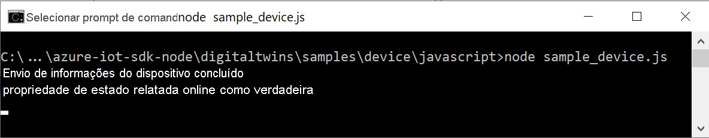

Este guia de início rápido mostra como criar um aplicativo de exemplo de dispositivo IoT Plug and Play, conectá-lo ao hub IoT e usar a ferramenta Azure IoT Explorer para exibir a telemetria que ele envia. O aplicativo de exemplo é gravado em Node.js e é incluído no SDK do dispositivo IoT do Azure para Node.js. Um construtor de soluções pode usar a ferramenta Azure IoT Explorer para compreender as funcionalidades de um dispositivo IoT Plug and Play sem a necessidade de ver nenhum código de dispositivo.

## <a name="prerequisites"></a>Pré-requisitos

[!INCLUDE [iot-pnp-prerequisites](iot-pnp-prerequisites.md)]

Para concluir este início rápido, você precisa do Node.js em seu computador de desenvolvimento. Você pode baixar a versão mais recente recomendada para várias plataformas de [nodejs.org](https://nodejs.org).

Você pode verificar a versão atual do Node.js no computador de desenvolvimento usando o seguinte comando:

```cmd/sh
node --version
```

## <a name="download-the-code"></a>Baixar o código

Neste início rápido, você preparará um ambiente de desenvolvimento que pode ser usado para clonar e compilar o SDK do dispositivo Hub IoT do Azure para Node.js.

Abra um prompt de comando no diretório de sua escolha. Execute o seguinte comando para clonar o repositório GitHub do [SDK do Microsoft Azure IoT para Node.js](https://github.com/Azure/azure-iot-sdk-node) nesta localização:

```cmd/sh
git clone https://github.com/Azure/azure-iot-sdk-node
```

## <a name="install-required-libraries"></a>Instalar as bibliotecas necessárias

Use o SDK do dispositivo para criar o código de exemplo incluído. O aplicativo criado simula um dispositivo que se conecta a um Hub IoT. O aplicativo envia a telemetria e as propriedades e recebe comandos.

1. Em uma janela de terminal local, acesse a pasta do repositório clonado e navegue até a pasta */azure-iot-sdk-node/device/samples/pnp*. Em seguida, execute o seguinte comando para instalar as bibliotecas necessárias:

    ```cmd/sh
    npm install
    ```

1. Configure a variável de ambiente com a cadeia de conexão do dispositivo que você anotou anteriormente:

    ```cmd/sh
    set IOTHUB_DEVICE_CONNECTION_STRING=<YourDeviceConnectionString>
    ```

## <a name="run-the-sample-device"></a>Executar o dispositivo de exemplo

Este exemplo implementa um dispositivo termostato simples do IoT Plug and Play. O modelo que esse exemplo implementa não usa os [componentes](../articles/iot-pnp/concepts-modeling-guide.md) do IoT Plug and Play. O [arquivo de modelo de DTDL para o dispositivo de termostato](https://github.com/Azure/opendigitaltwins-dtdl/blob/master/DTDL/v2/samples/Thermostat.json) define a telemetria, as propriedades e os comandos que o dispositivo implementa.

Abra o arquivo _simple_thermostat.js_. Nesse arquivo, você pode ver como:

1. Importar as interfaces necessárias.
1. Grave um manipulador de atualização de propriedade e um manipulador de comando.
1. Manipule os patches de propriedade desejados e envie a telemetria.
1. Opcionalmente, provisione o dispositivo usando o DPS (Serviço de Provisionamento de Dispositivos) do Azure.

Na função principal, você pode ver como tudo isso é agrupado:

1. Crie o dispositivo da sua cadeia de conexão ou provisione-o usando o DPS.)
1. Use a opção **modelID** para especificar o modelo de dispositivo IoT Plug and Play.
1. Habilite o manipulador de comandos.
1. Envie telemetria do dispositivo para o hub.
1. Obtenha os dispositivos gêmeos e atualize as propriedades relatadas.
1. Habilite o manipulador de atualização de propriedade desejado.

[!INCLUDE [iot-pnp-environment](iot-pnp-environment.md)]

Para saber mais sobre a configuração do exemplo, confira o [leiame de exemplo](https://github.com/Azure/azure-iot-sdk-node/blob/master/device/samples/pnp/readme.md).

Execute um aplicativo de exemplo para simular um dispositivo IoT Plug and Play que envia telemetria ao hub IoT. Para executar o aplicativo de exemplo, use o seguinte comando:

```cmd\sh
node simple_thermostat.js
```

Você vê a saída a seguir, indicando que o dispositivo começou a enviar dados telemétricos para o hub e agora está pronto para receber comandos e atualizações de propriedade.



Mantenha o exemplo em execução enquanto você conclui as próximas etapas.

## <a name="use-azure-iot-explorer-to-validate-the-code"></a>Usar o Azure IoT Explorer para validar o código

Após iniciar o exemplo de cliente do dispositivo, use a ferramenta Azure IoT Explorer para verificar se ele está funcionando.

[!INCLUDE [iot-pnp-iot-explorer.md](iot-pnp-iot-explorer.md)]
