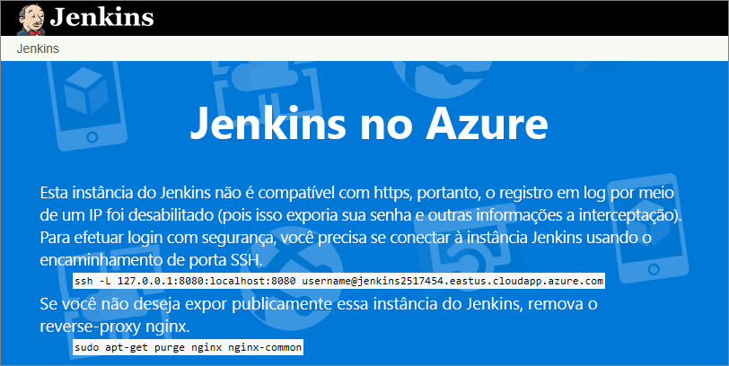
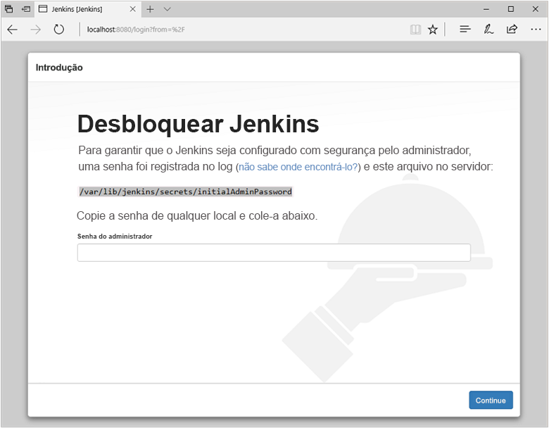
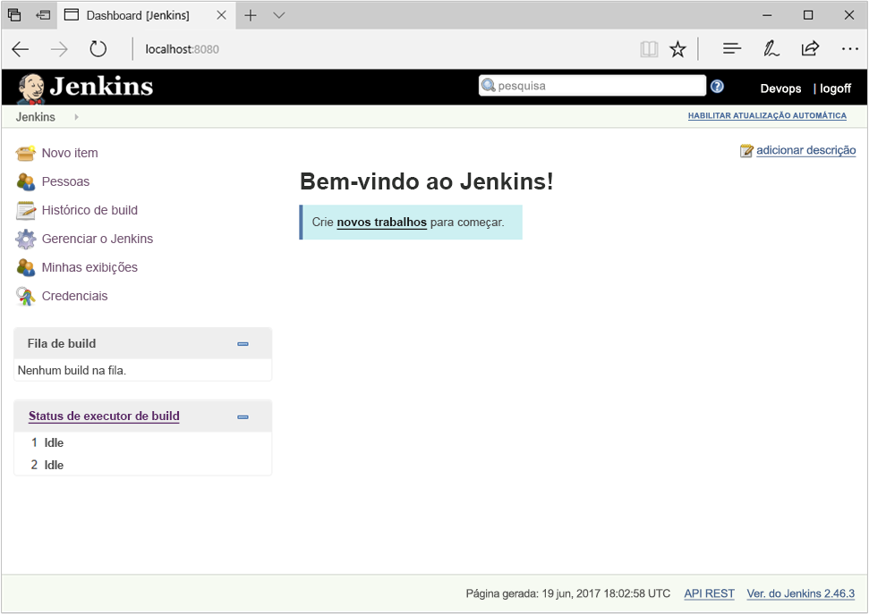
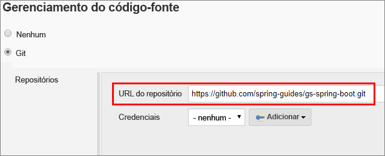
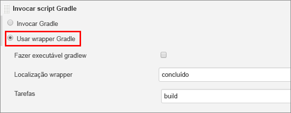

## <a name="prerequisites"></a>Prerequisites

* Uma assinatura do Azure
* Acesso a SSH na linha de comando do computador (como o shell Bash ou o [PuTTY](https://www.putty.org/))

[!INCLUDE [quickstarts-free-trial-note](quickstarts-free-trial-note.md)]

## <a name="create-the-jenkins-vm-from-the-solution-template"></a>Criar a VM Jenkins do modelo de solução
Jenkins dá suporte a um modelo onde o servidor Jenkins delega trabalho para um ou mais agentes para permitir que uma única instalação Jenkins hospede um número grande de projetos ou para fornecer ambientes diferentes, necessários para compilações ou testes. As etapas nesta seção o orientam durante a instalação e configuração de um servidor Jenkins no Azure.

[!INCLUDE [jenkins-install-from-azure-marketplace-image](jenkins-install-from-azure-marketplace-image.md)]

## <a name="connect-to-jenkins"></a>Conectar-se ao Jenkins

Navegue até sua máquina virtual (por exemplo, `http://jenkins2517454.eastus.cloudapp.azure.com/`) no navegador da Web. O console do Jenkins não pode ser acessado por meio de HTTP não segura e, portanto, instruções são fornecidas na página para acessar o console do Jenkins com segurança do seu computador usando um túnel SSH.



Configure o túnel usando o comando `ssh` na página a partir da linha de comando, substituindo `username` pelo nome do usuário administrador da máquina virtual escolhido anteriormente durante a configuração da máquina virtual no modelo de solução.

```bash
ssh -L 127.0.0.1:8080:localhost:8080 jenkinsadmin@jenkins2517454.eastus.cloudapp.azure.com
```

Depois de iniciar o túnel, navegue para `http://localhost:8080/` no computador local. 

Obtenha a senha inicial executando o comando abaixo na linha de comando, enquanto estiver conectado à VM Jenkins por meio do SSH.

```bash
sudo cat /var/lib/jenkins/secrets/initialAdminPassword
```

Desbloqueie o painel Jenkins pela primeira vez usando essa senha inicial.



Selecione **Instalar plug-ins sugeridos** na próxima página e crie um usuário administrador do Jenkins usado para acessar o painel do Jenkins.



O servidor Jenkins agora está pronto para compilar código.

## <a name="create-your-first-job"></a>Criar seu primeiro trabalho

Selecione **Criar novos trabalhos** no console do Jenkins, nomeie-o **mySampleApp** e selecione **projeto Freestyle**. Em seguida, selecione **OK**.

 

Selecione a guia **Gerenciamento de código-fonte**, habilite o **Git**e digite a seguinte URL no campo **URL do Repositório**:`https://github.com/spring-guides/gs-spring-boot.git`

 

Selecione a guia **Build** e selecione **Adicionar etapa de compilação**, **Invocar script Gradle**. Selecione **Usar Wrapper Gradle**, digite `complete` na **localização do Wrapper** e `build` como **Tarefas**.

 

Selecione **Avançado** e insira `complete` no campo **Script de Compilação da Raiz**. Clique em **Salvar**.

 

## <a name="build-the-code"></a>Compilar o código

Selecione **Criar agora** para compilar o código e empacotar o aplicativo de exemplo. Quando a compilação for concluída, selecione o link **Workspace** para o projeto.

 

Navegue até `complete/build/libs` e verifique se o `gs-spring-boot-0.1.0.jar` está disponível a fim de verificar se a compilação foi bem-sucedida. O servidor Jenkins agora está pronto para criar seus próprios projetos no Azure.

## <a name="troubleshooting-the-jenkins-solution-template"></a>Solução de problemas do modelo de solução do Jenkins

Caso encontre bugs com o modelo de solução do Jenkins, registre um problema no [repositório GitHub do Jenkins](https://github.com/azure/jenkins/issues).

## <a name="next-steps"></a>Próximas etapas

> [!div class="nextstepaction"]
> [Adicionar VMs do Azure como agentes do Jenkins](/azure/jenkins/jenkins-azure-vm-agents)