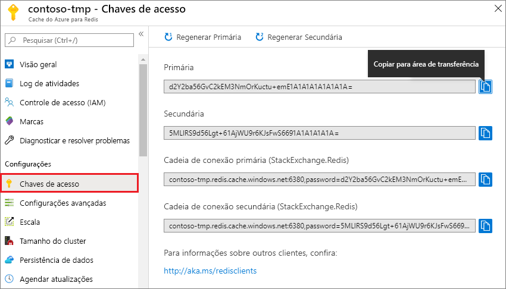

### Recuperar o nome de host, as portas e as chaves de acesso do portal do Azure

Para conectar-se a uma instância do Cache do Azure para Redis, os clientes de cache precisam do nome de host, das portas e de uma chave para o cache. Alguns clientes podem se referir a esses itens por nomes um pouco diferentes. Você pode obter o nome do host, as portas e as chaves do [portal do Azure](https://portal.azure.com).

- Para obter as chaves de acesso, na navegação à esquerda do cache, selecione **Chaves de acesso**. 
  
  

- Para obter o nome do host e as portas, no painel de navegação esquerdo do cache, selecione **Propriedades**. O nome do host está no formato *\<DNS name>.redis.cache.windows.net*.

  

