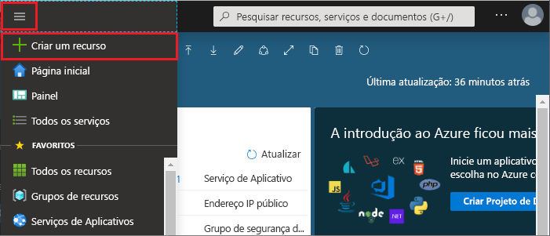
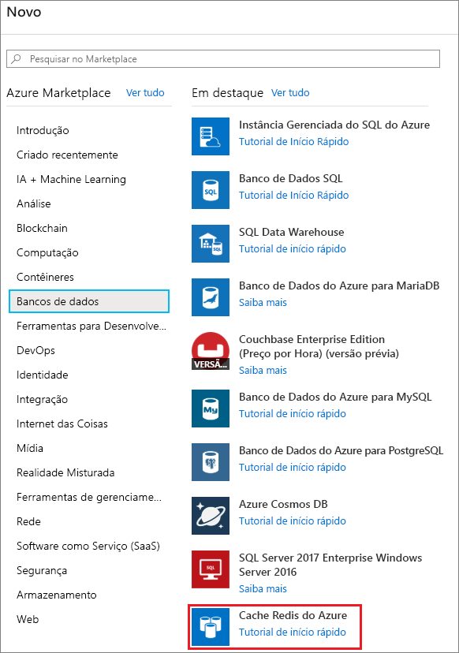
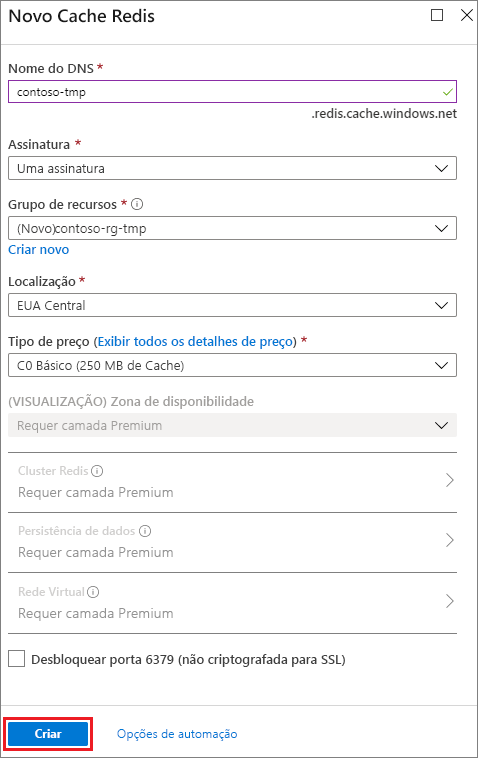

1. Para criar um cache, entre no [portal do Azure](https://portal.azure.com) e selecione **Criar um recurso**. 
   
   
   
1. Na página **Novo**, selecione **Bancos de dados** e, em seguida, **Cache do Azure para Redis**.
   
   
   
1. Na página **Novo Cache Redis**, defina as configurações para o novo cache.
   
   | Configuração      | Valor sugerido  | DESCRIÇÃO |
   | ------------ |  ------- | -------------------------------------------------- |
   | **Nome DNS** | Insira um nome global exclusivo. | O nome de cache precisa ser uma cadeia de caracteres com 1 a 63 caracteres que contém somente números, letras ou hifens. O nome precisa começar e terminar com um número ou uma letra e não pode conter hifens consecutivos. O *nome do host* da instância de cache será *\<nome DNS>.redis.cache.windows.net*. | 
   | **Assinatura** | Clique na lista suspensa e selecione sua assinatura. | A assinatura na qual essa nova instância do Cache do Azure para Redis será criada. | 
   | **Grupo de recursos** | Clique na lista suspensa e selecione um grupo de recursos ou selecione **Criar** e insira um novo nome de grupo de recursos. | Nome do grupo de recursos no qual o cache e outros recursos serão criados. Ao colocar todos os seus recursos de aplicativos em um só grupo de recursos, você pode gerenciá-los ou excluí-los juntos com facilidade. | 
   | **Localidade** | Clique na lista suspensa e selecione uma localização. | Selecione uma [região](https://azure.microsoft.com/regions/) perto de outros serviços que usarão o cache. |
   | **Tipo de preços** | Clique na lista suspensa e selecione um [Tipo de preço](https://azure.microsoft.com/pricing/details/cache/). |  O tipo de preço determina o tamanho, o desempenho e os recursos disponíveis para o cache. Para obter mais informações, confira [Visão geral do Cache do Azure para Redis](../articles/azure-cache-for-redis/cache-overview.md). |
   
1. Selecione **Criar**. 
   
    
   
   A criação do cache demora um pouco. Monitore o progresso na página **Visão Geral** do Cache do Azure para Redis. Quando o **Status** for mostrado como **Em execução**, o cache estará pronto para uso.
   
   

