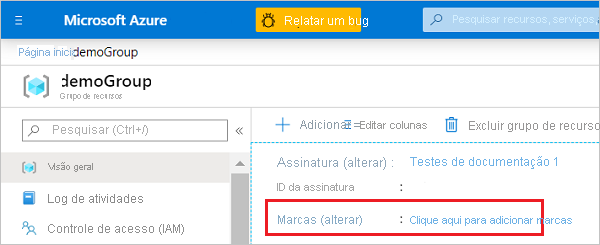
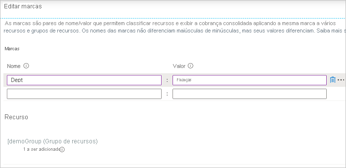
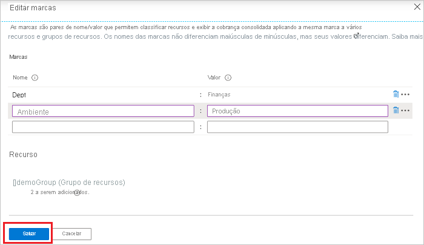
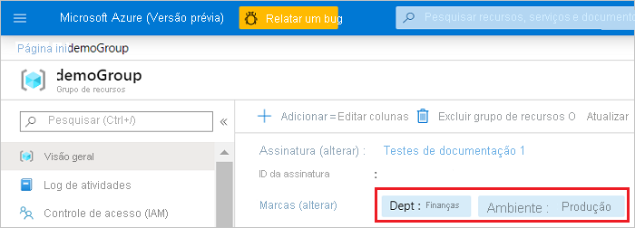
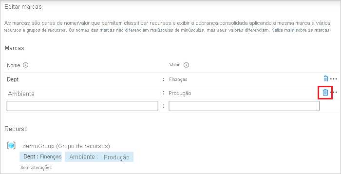
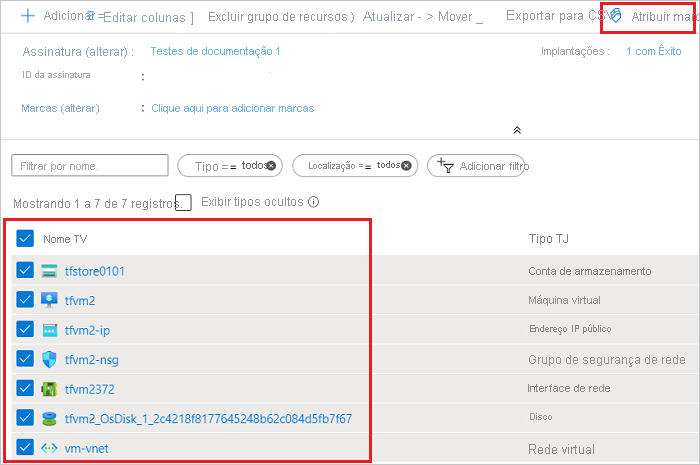
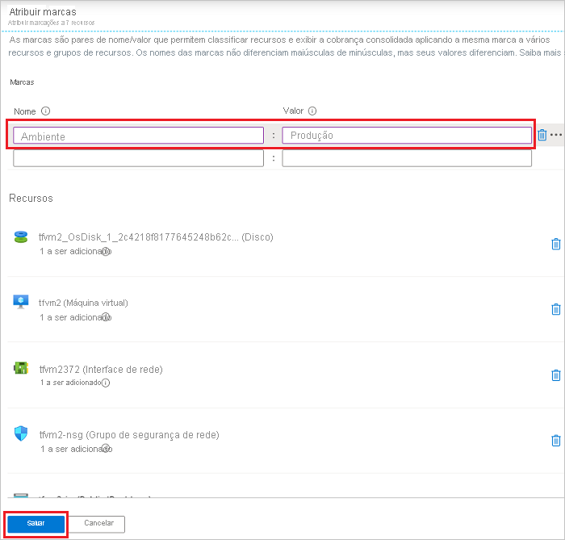
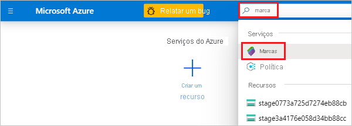
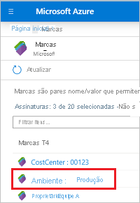
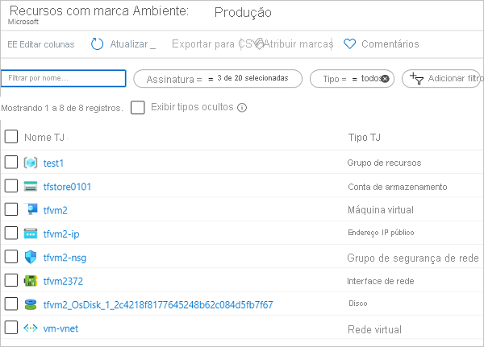

Se um usuário não tiver o acesso necessário para aplicar marcas, você poderá atribuir a função de **colaborador de marca** ao usuário. Para obter mais informações, consulte [tutorial: conceder a um usuário acesso aos recursos do Azure usando o RBAC e o portal do Azure](../articles/role-based-access-control/quickstart-assign-role-user-portal.md).

1. Para exibir as marcas de um recurso ou grupo de recursos, procure as marcas existentes na visão geral. Se você não tiver aplicado marcas anteriormente, a lista estará vazia.

   

1. Para adicionar uma marca, selecione **Clique aqui para adicionar marcas**.

1. Forneça um nome e valor.

   

1. Continue adicionando marcas conforme necessário. Ao terminar, escolha **Salvar**.

   

1. As marcas são exibidas agora na visão geral.

   

1. Para adicionar ou excluir uma marca, selecione **alterar**.

1. Para excluir uma marca, selecione o ícone de lixeira. Em seguida, selecione **salvar**.

   

Para atribuir marcas em massa para vários recursos:

1. A partir de qualquer lista de recursos, selecione a caixa de seleção para os recursos aos quais você deseja atribuir a marca. Em seguida, selecione **atribuir marcas**.

   

1. Adicione nomes e valores. Ao terminar, escolha **Salvar**.

   

Para exibir todos os recursos com uma marca:

1. No menu portal do Azure, procure **marcas**. Selecione-o nas opções disponíveis.

   

1. Selecione a marca para recursos de visualização.

   

1. Todos os recursos com essa marca são exibidos.

   
