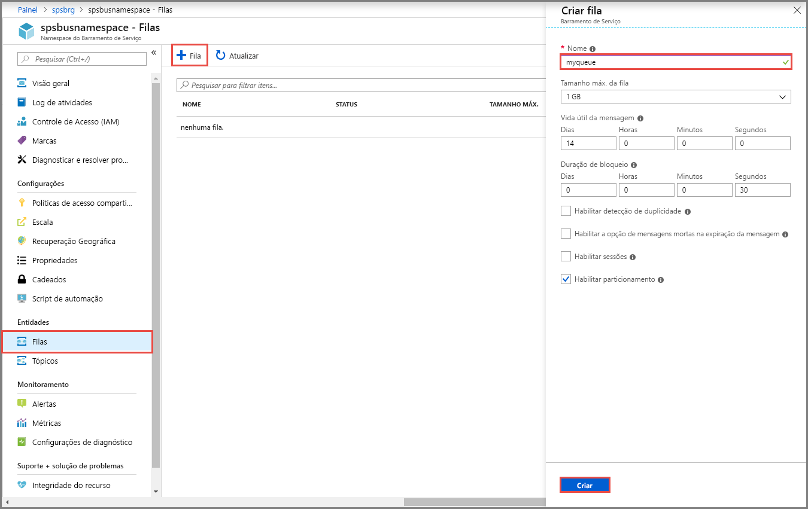

## Criar uma fila no portal do Azure
1. Na página **Namespace de Barramento de Serviço**, selecione **Filas** no menu de navegação à esquerda.
1. Na página **Filas**, selecione **+ Fila** na barra de ferramentas.
1. Insira um **nome** para a fila e deixe os outros valores com os padrões.
1. Agora, selecione **Criar**.
 
    

