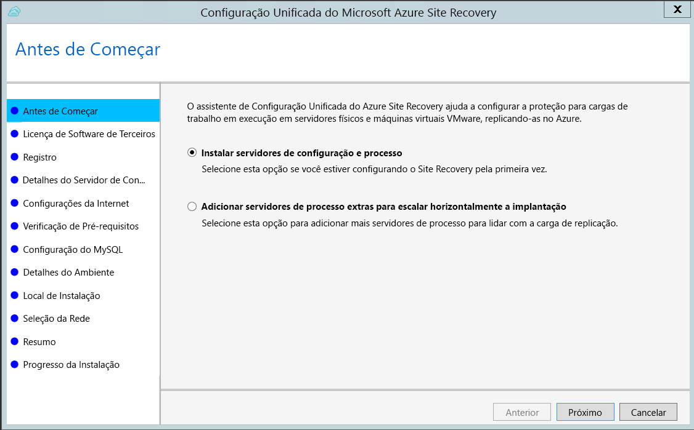
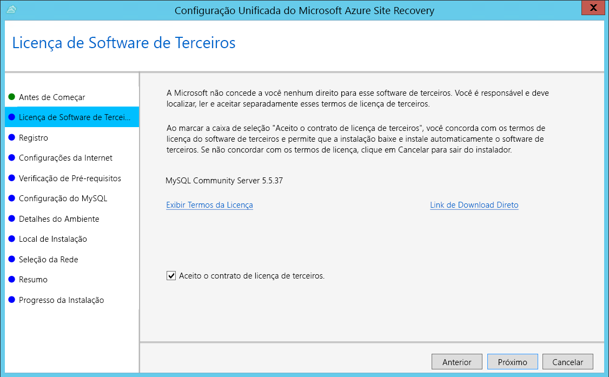
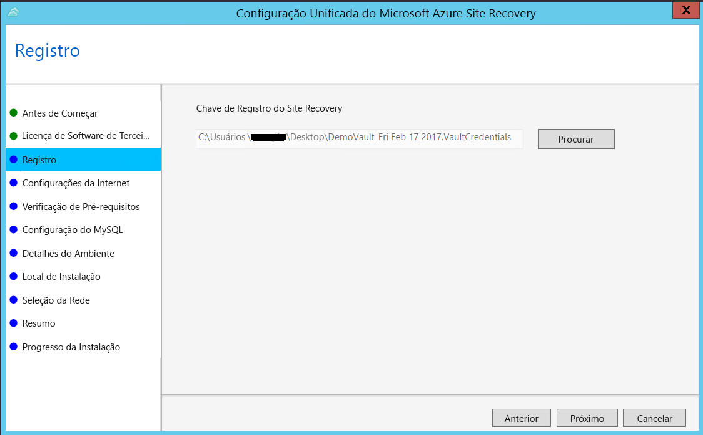
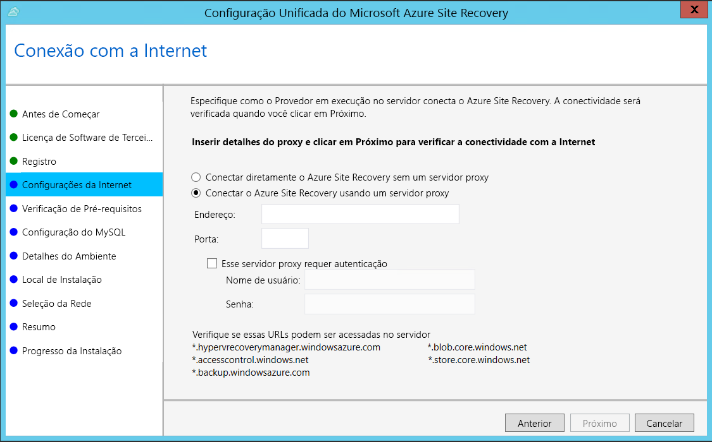
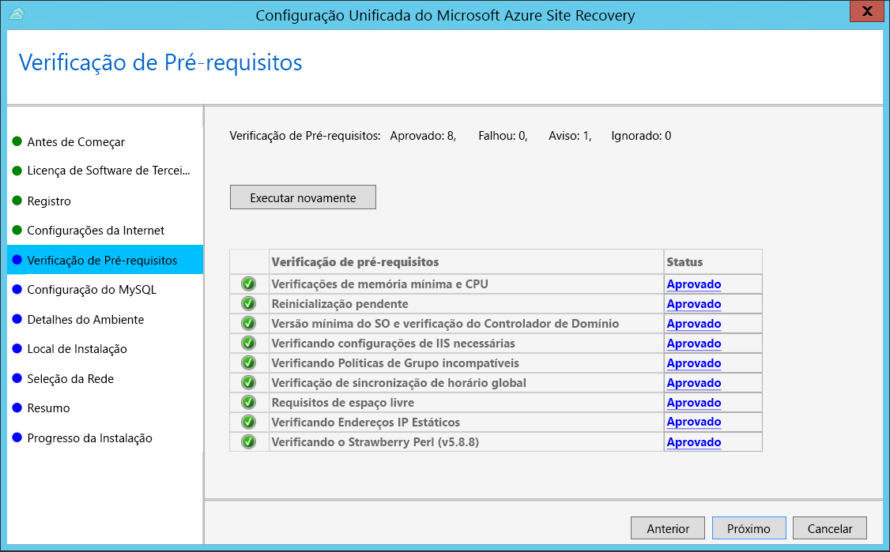
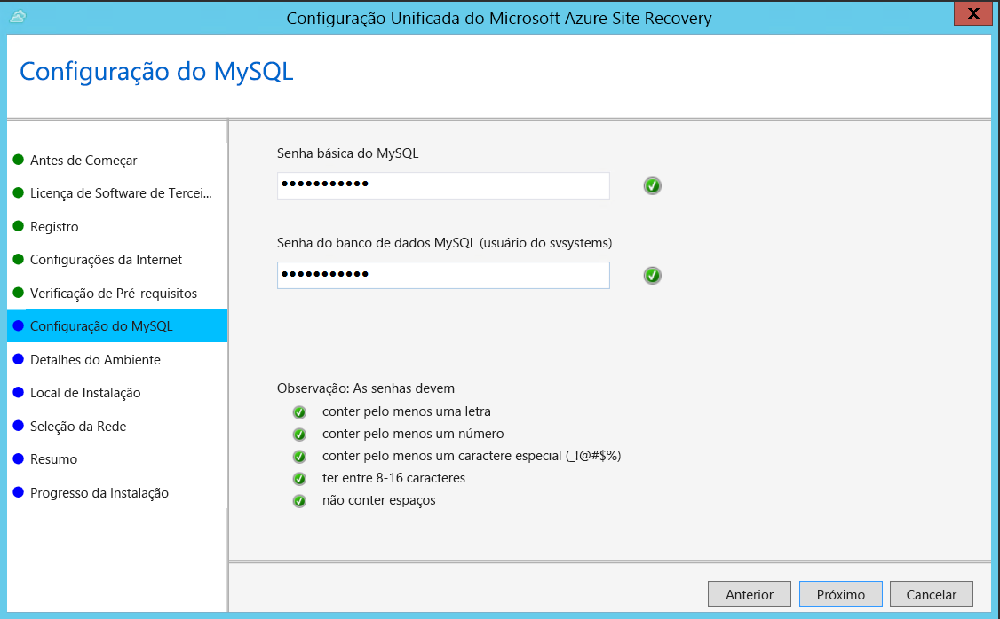
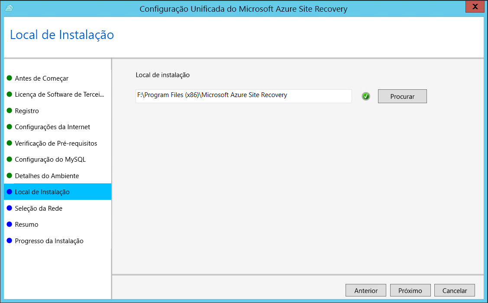
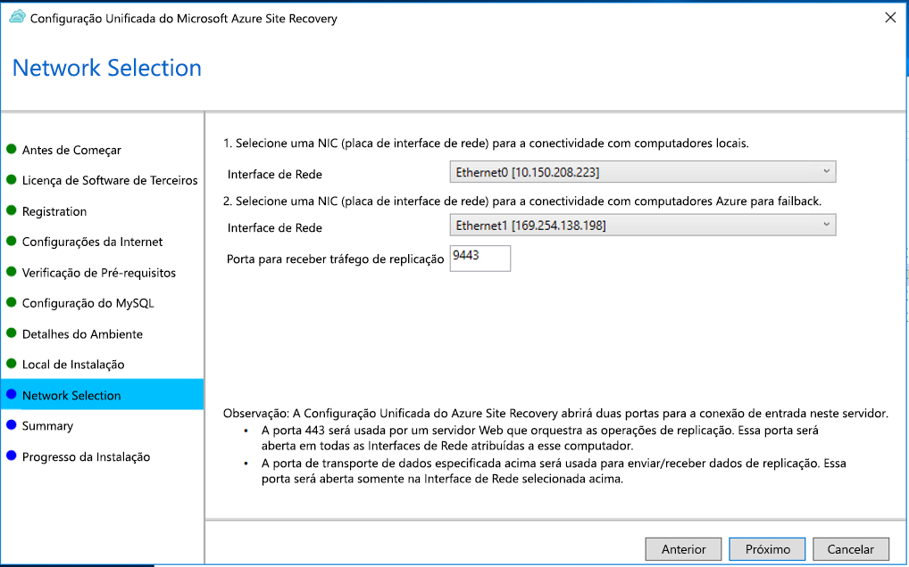
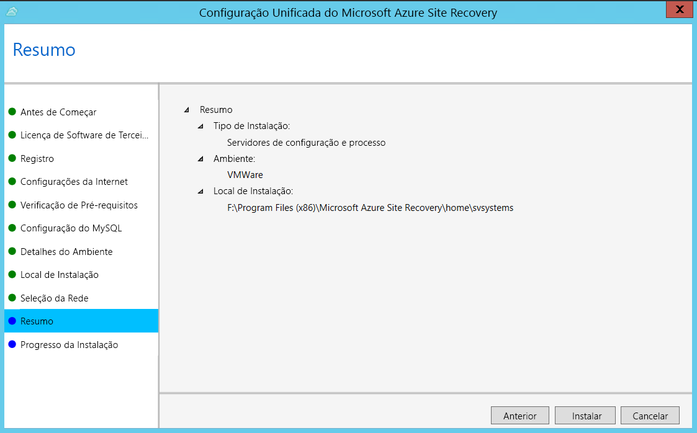

1. Execute o arquivo de instalação de Configuração Unificada.
2. Em **Antes de começar**, selecione **Instalar o servidor de configuração e o servidor em processo**.

    

3. Em **Licença de Software de Terceiros**, clique em **Aceito** para baixar e instalar o MySQL.

    
4. Em **Registro**, selecione a chave de registro que você baixou do cofre.

    
5. Em **Configurações da Internet**, especifique como o Provedor em execução no servidor de configuração se conecta ao Azure Site Recovery pela Internet. Verifique se você permitiu as URLs necessárias.

    - Se você desejar se conectar ao proxy que está configurado atualmente no computador, selecione **Conectar-se ao Azure Site Recovery usando um servidor proxy**.
    - Se quiser que o Provedor se conecte diretamente, selecione **Conectar diretamente o Azure Site Recovery sem um servidor proxy**.
    - Se o proxy existente exigir autenticação ou se você quiser usar um proxy personalizado para a conexão do provedor, selecione **Conectar-se com as configurações de proxy personalizadas** e especifique o endereço, a porta e as credenciais.
     
6. Em **Verificação de Pré-requisitos**, a configuração executa uma verificação para garantir que a instalação pode ser executada. Se aparecer um aviso sobre a **Verificação de sincronização de tempo global**, verifique se a hora no relógio do sistema (configurações de **Data e Hora**) é a mesma que a do fuso horário.

    
7. Em **Configuração do MySQL**, crie credenciais para fazer logon na instância do servidor MySQL instalada.

    
8. Em **Detalhes do ambiente**, selecione Não se você estiver replicando VMs do Azure Stack ou servidores físicos. 
9. Em **Localização de Instalação**, selecione a localização em que você deseja instalar os binários e armazenar o cache. A unidade selecionado deve ter ao menos 5 GB de espaço em disco disponível, mas é recomendável uma unidade de cache com ao menos 600 GB de espaço livre.

    
10. Em **Seleção da Rede**, primeiro selecione a NIC usada pelo servidor de processo interno para descoberta e instalação por push do serviço de mobilidade em computadores de origem. Em seguida, selecione a NIC que o servidor de configuração usa para conectividade com o Azure. A porta 9443 é a porta padrão usada para enviar e receber o tráfego de replicação, mas você pode modificar esse número de porta para atender aos requisitos do seu ambiente. Além da porta 9443, também podemos abrir a porta 443, usada por um servidor Web para coordenar operações de replicação. Não use a porta 443 para enviar ou receber tráfego de replicação.

    

11. Em **Resumo**, examine as informações e clique em **Instalar**. Após a conclusão da instalação, uma frase secreta é gerada. Você precisará dela quando habilitar a replicação, portanto copie-a e guarde-a em um local seguro.

    

Após a conclusão do registro, o servidor é exibido na folha **Configurações** > **Servidores** no cofre.
