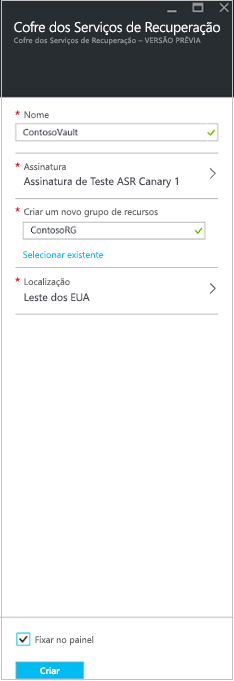

1. Entre no [portal do Azure](https://portal.azure.com) > **Serviços de Recuperação**.
2. Clique em **Criar um recurso** > **Monitoramento + Gerenciamento** > **Backup e Site Recovery**.
3. Em **Nome**, especifique um nome amigável para identificar o cofre. Se você tiver mais de uma assinatura, selecione uma delas.
4. [Crie um grupo de recursos](../articles/azure-resource-manager/templates/deploy-portal.md)ou selecione um existente. Especifique uma região do Azure. 
5. Para acessar rapidamente o cofre do painel, clique em **Fixar no painel** > **Criar**.

   

   O novo cofre será exibido no **Painel** > **Todos os recursos** e na página **Cofres de Serviços de Recuperação** principal.
