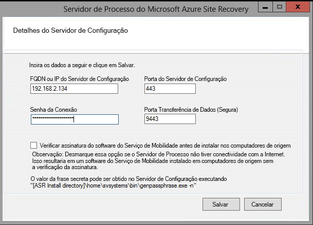

1. Estabeleça uma Conexão de Área de Trabalho Remota com o computador que está executando o servidor do processo. 
2. Execute cspsconfigtool.exe para iniciar a ferramenta de configuração do Servidor de Processos do Azure Site Recovery.
    - A ferramenta é iniciada automaticamente na primeira vez que você entra no servidor de processos.
    - Se ela não abrir automaticamente, clique no atalho da área de trabalho.

3. Em **FQDN ou IP do servidor de configuração**, especifique o nome ou o endereço IP do servidor de configuração com o qual registrar o servidor de processos.
4. Em **Porta do servidor de configuração**, verifique se está especificado 443. Essa é a porta na qual o servidor de configuração escuta as solicitações.
5. Em **Frase secreta de conexão**, especifique a frase secreta que você especificou ao definir o servidor de configuração. Para encontrar a frase secreta:
    -  No servidor de configuração, navegue até a pasta de instalação do Site Recovery * *\home\svssystems\bin\** :
    ```
    cd %ProgramData%\ASR\home\svsystems\bin
    ```
    - Execute o comando abaixo para imprimir a frase secreta atual:
    ```
    genpassphrase.exe -n
    ```

6. Em **Porta para Transferência de Dados**, deixe o valor padrão, a menos que tenha especificado uma porta personalizada.

7. Clique em **Salvar** para salvar as configurações e registre o servidor de processos.

    
    
