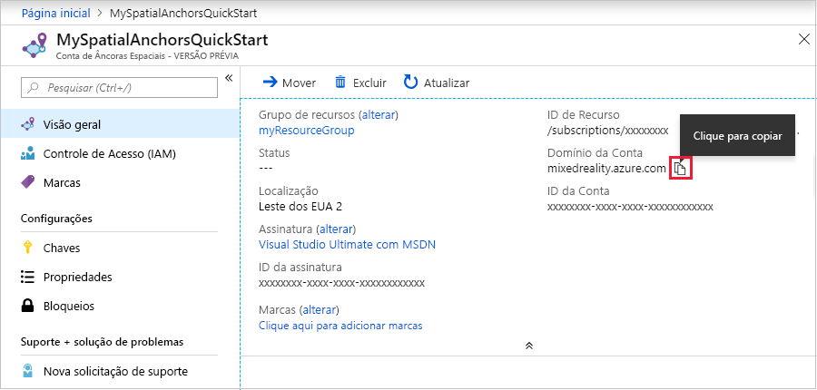

## <a name="create-a-spatial-anchors-resource"></a>Criar um recurso Âncoras Espaciais

### <a name="portal"></a>[Portal](#tab/azure-portal)

Vá para o <a href="https://portal.azure.com" target="_blank">Portal do Azure</a>.

No painel esquerdo, clique em **Criar um recurso**.

Use a caixa de pesquisa para **Âncoras Espaciais**.


Selecione **Âncoras Espaciais** e clique em **Criar**.

No painel **Conta de Âncoras Espaciais**, faça o seguinte:

* Insira um nome de recurso exclusivo usando caracteres alfanuméricos normais.  
* Selecione a assinatura que você deseja anexar o recurso.  
* Crie um grupo de recursos, selecionando **Criar novo**. Nomeie-o **myResourceGroup** e clique em **OK**.  

  [!INCLUDE [resource group intro text](resource-group.md)]
  
* Selecione um local (região) para criar o recurso.  
* Selecione **Novo** para começar a criar o recurso.


Depois que o recurso for criado, o portal do Azure mostrará que a implantação foi concluída. 
   


Selecione **Ir para o recurso**. Agora você pode ver as propriedades do recurso. 
   
Copie o valor da **ID da Conta** do recurso em um editor de texto para usar posteriormente.


Copie também o valor do **Domínio de Contas** do recurso em um editor de texto para usar posteriormente.



Em **Configurações**, selecione **Chave**. Copie o valor da **Chave primária**, **Chave de Conta**, em um editor de texto para usar posteriormente.


### <a name="azure-cli"></a>[CLI do Azure](#tab/azure-cli)

Comece preparando seu ambiente para a CLI do Azure:

[!INCLUDE [azure-cli-prepare-your-environment-no-header.md](azure-cli-prepare-your-environment-no-header.md)]

1. Depois de se conectar, use o comando [az account set](/cli/azure/account#az_account_set) para escolher a assinatura na qual a conta de âncoras espaciais será configurada:

   ```azurecli
   az account set --subscription 00000000-0000-0000-0000-000000000000
   ```

1. Execute o comando [az group create](/cli/azure/group#az_group_create) para criar um grupo de recursos ou use um grupo de recursos existente:

   ```azurecli
   az group create --name myResourceGroup --location eastus2
   ```

   [!INCLUDE [resource group intro text](resource-group.md)]

   Veja suas contas atuais de âncoras espaciais para um grupo de recursos usando o comando [az spatial-anchors-account list](/cli/azure/ext/mixed-reality/spatial-anchors-account#ext_mixed_reality_az_spatial_anchors_account_list):

   ```azurecli
   az spatial-anchors-account list --resource-group myResourceGroup
   ```

   Veja também as contas de âncoras espaciais para sua assinatura:

   ```azurecli
   az spatial-anchors-account list
   ```

1. Execute o comando [az spatial-anchors-account create](/cli/azure/ext/mixed-reality/spatial-anchors-account#ext_mixed_reality_az_spatial_anchors_account_create) para criar sua conta de âncoras espaciais:

   ```azurecli
   az spatial-anchors-account create --resource-group myResourceGroup --name MySpatialAnchorsQuickStart --location eastus2
   ```

1. Veja as propriedades do recurso usando o comando [az spatial-anchors-account show](/cli/azure/ext/mixed-reality/spatial-anchors-account#ext_mixed_reality_az_spatial_anchors_account_show):

   ```azurecli
   az spatial-anchors-account show --resource-group myResourceGroup --name MySpatialAnchorsQuickStart
   ```

   Copie os valores de **ID da Conta** e **Domínio da Conta** do recurso em um editor de texto para uso posterior.

1. Execute o comando [az spatial-anchors-account key show](/cli/azure/ext/mixed-reality/spatial-anchors-account/key#ext_mixed_reality_az_spatial_anchors_account_key_show) para obter suas chaves primária e secundária:

   ```azurecli
   az spatial-anchors-account key show --resource-group myResourceGroup --name MySpatialAnchorsQuickStart
   ```

   Copie os valores das chaves em um editor de texto para uso posterior.

   Caso precise regenerar as chaves, use o comando [az spatial-anchors-account key renew](/cli/azure/ext/mixed-reality/spatial-anchors-account/key#ext_mixed_reality_az_spatial_anchors_account_key_renew):

   ```azurecli
   az spatial-anchors-account key renew --resource-group myResourceGroup --name example --key primary
   az spatial-anchors-account key renew --resource-group myResourceGroup --name example --key secondary
   ```

Exclua uma conta usando o comando [az spatial-anchors-account delete](/cli/azure/ext/mixed-reality/spatial-anchors-account#ext_mixed_reality_az_spatial_anchors_account_delete):

```azurecli
az spatial-anchors-account delete --resource-group myResourceGroup --name MySpatialAnchorsQuickStart
```

---
