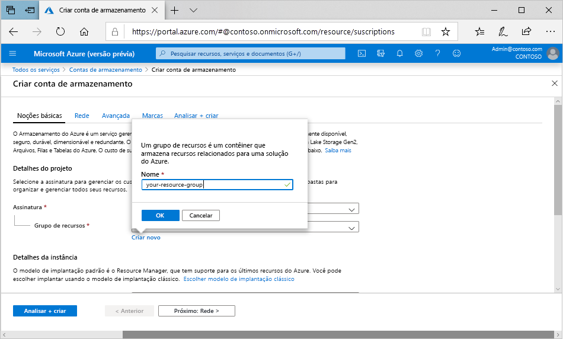

Para criar uma conta de armazenamento de uso geral v2 no portal do Azure, siga estas etapas:

1. No menu do portal do Azure, selecione **Todos os serviços**. Na lista de recursos, digite **Contas de armazenamento**. Quando você começa a digitar, a lista é filtrada com base em sua entrada. Selecione **Contas de Armazenamento**.
2. Na janela **Contas de Armazenamento** que aparece, escolha **Adicionar**.
3. Selecione a assinatura na qual você deseja criar a conta de armazenamento.
4. No campo **Grupo de recursos**, selecione **Criar novo**. Insira um nome para seu novo grupo de recursos, conforme mostrado na imagem a seguir.

    

5. Em seguida, insira um nome para sua conta de armazenamento. O nome escolhido deve ser exclusivo no Azure. O nome também deve ter entre 3 e 24 caracteres e pode incluir apenas números e letras minúsculas.
6. Selecione um local para sua conta de armazenamento ou use o local padrão.
7. Deixe esses campos definidos como seus valores padrão:

   |Campo  |Valor  |
   |---------|---------|
   |Modelo de implantação     |Gerenciador de Recursos         |
   |Desempenho     |Standard         |
   |Tipo de conta     |StorageV2 (uso geral v2)         |
   |Replicação     |Armazenamento com redundância geográfica com acesso de leitura (RA-GRS)         |
   |Camada de acesso     |Dinâmica         |

8. Se você planeja usar o [Azure Data Lake Storage](https://azure.microsoft.com/services/storage/data-lake-storage/), escolha a guia **Avançado** e, em seguida, defina **Namespace hierárquico** como **Habilitado**.
9. Selecione **Revisar + Criar** para examinar as configurações da conta de armazenamento e criar a conta.
10. Selecione **Criar**.

Para obter mais informações sobre tipos de contas de armazenamento e outras configurações da conta de armazenamento, confira [Visão geral da conta de armazenamento do Azure](https://docs.microsoft.com/azure/storage/common/storage-account-overview). Para saber mais sobre grupos de recursos, confira [Visão geral do Azure Resource Manager](https://docs.microsoft.com/azure/azure-resource-manager/resource-group-overview). 
