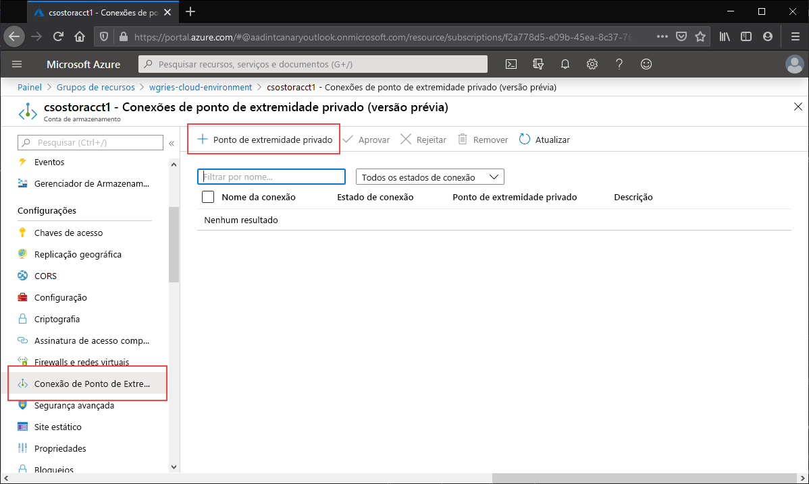
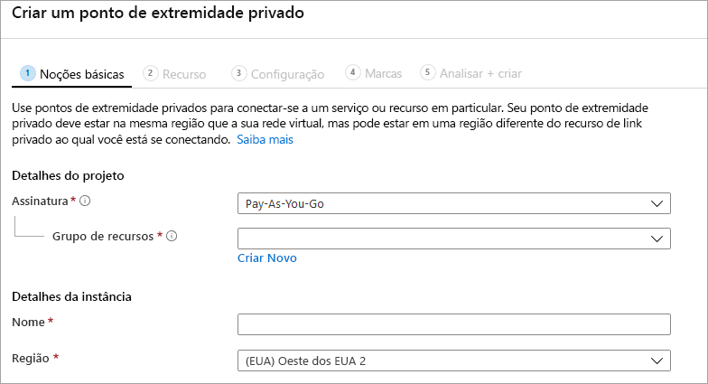

Navegue até a conta de armazenamento para a qual gostaria de criar o ponto de extremidade privado. Na sumário da conta de armazenamento, selecione **Conexões de ponto de extremidade privado** e, em seguida, **+ Ponto de extremidade privado** para criar um ponto de extremidade privado. 

O assistente resultante tem várias páginas a serem preenchidas.

Na folha **Básico**, selecione o grupo de recursos, o nome e a região desejados para o ponto de extremidade privado. Essas configurações podem ter o valor que você quiser, elas não precisam corresponder à conta de armazenamento, embora seja necessário criar o ponto de extremidade privado na mesma região que a rede virtual na qual você deseja criá-lo.

Na folha **Recurso**, selecione o botão de opção para **Conectar-se a um recurso do Azure em meu diretório**. Em **Tipo de recurso**, selecione **Microsoft.Storage/storageAccounts**. O campo **Recurso** é a conta de armazenamento com o compartilhamento de arquivo do Azure ao qual você deseja se conectar. O sub-recurso de destino é **arquivo**, uma vez que se trata dos Arquivos do Azure.

A folha **Configuração** permite que você selecione a rede virtual específica e a sub-rede à qual deseja adicionar o ponto de extremidade privado. Você precisa selecionar uma sub-rede diferente daquela à qual adicionou o ponto de extremidade de serviço acima. A folha Configuração também contém as informações para criar/atualizar a zona DNS privada. Recomendamos usar a zona `privatelink.file.core.windows.net` padrão.

Clique em **Examinar + Criar** para criar o ponto de extremidade privado. 
