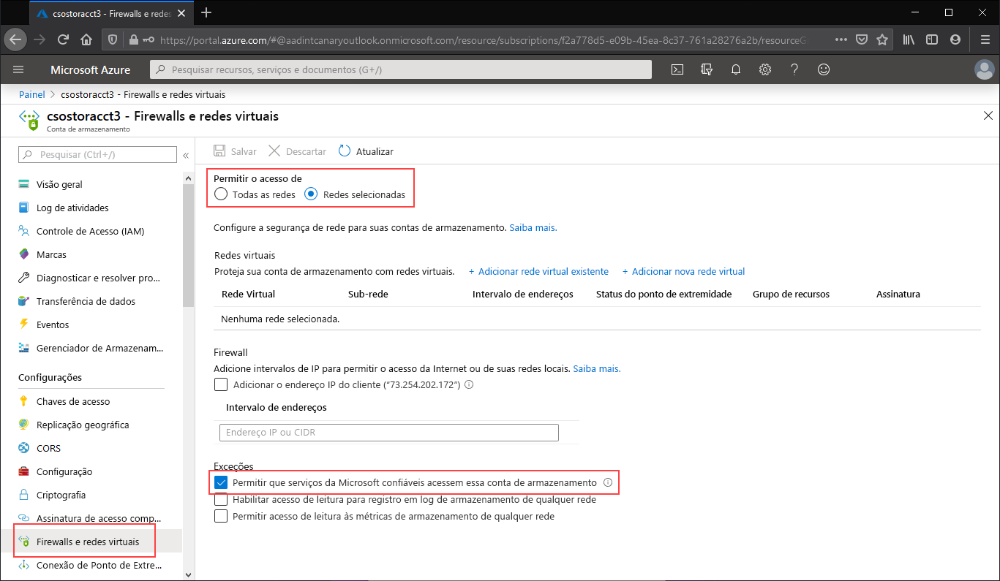

Navegue até a conta de armazenamento para a qual gostaria de restringir todo o acesso ao ponto de extremidade público. No sumário da conta de armazenamento, selecione **Rede**.

Na parte superior da página, selecione o botão de opção **Redes selecionadas**. Isso exibirá várias configurações para controlar a restrição do ponto de extremidade público. Marque **Permitir que serviços Microsoft confiáveis acessem esta conta de serviço** para permitir que serviços Microsoft confiáveis, como a Sincronização de Arquivos do Azure, acessem a conta de armazenamento.

