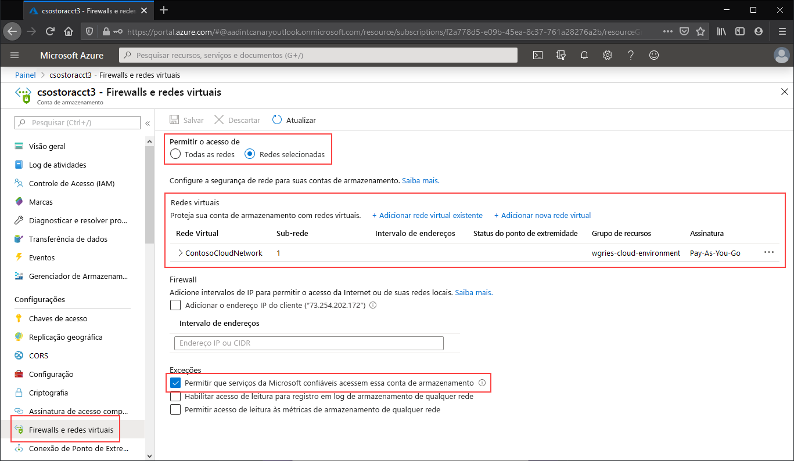

Navegue até a conta de armazenamento para a qual gostaria de restringir o ponto de extremidade público para redes virtuais específicas. No sumário da conta de armazenamento, selecione **Rede**. 

Na parte superior da página, selecione o botão de opção **Redes selecionadas**. Isso exibirá várias configurações para controlar a restrição do ponto de extremidade público. Clique em **+ Adicionar rede virtual existente** para selecionar a rede virtual específica que deve ter permissão para acessar a conta de armazenamento por meio do ponto de extremidade público. Para isso, será necessário selecionar uma rede virtual e uma sub-rede para essa rede virtual. 

Marque **Permitir que serviços Microsoft confiáveis acessem esta conta de serviço** para permitir que serviços Microsoft confiáveis, como a Sincronização de Arquivos do Azure, acessem a conta de armazenamento.

