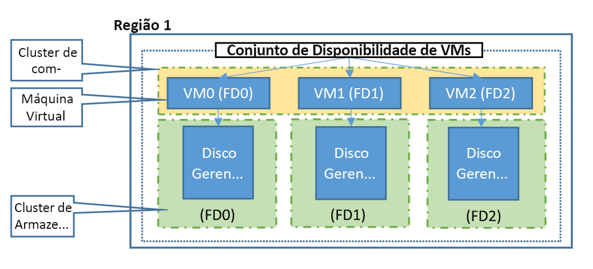

## <a name="understand-vm-reboots---maintenance-vs-downtime"></a>Entender as reinicializações de VM - manutenção vs. tempo de inatividade
Há três cenários que podem afetar a máquina virtual no Azure: manutenção de hardware não planejada, tempo de inatividade inesperado e manutenção planejada.

* O **Evento de Manutenção de Hardware Não Planejado** ocorre quando a plataforma do Azure prevê que o hardware ou qualquer componente de plataforma associado a um computador físico está prestes a falhar. Quando a plataforma previr uma falha, ela emitirá um evento de manutenção de hardware não planejada para reduzir o impacto em máquinas virtuais hospedadas no hardware. O Azure usa a tecnologia de [Migração ao Vivo](https://docs.microsoft.com/azure/virtual-machines/linux/maintenance-and-updates) para migrar as Máquinas Virtuais do hardware com falha para um computador físico íntegro. A Migração ao Vivo é uma operação de preservação de VM que só pausa a Máquina Virtual por um curto período. A memória, os arquivos abertos e as conexões de rede são mantidos, mas o desempenho pode ser reduzido antes e/ou depois do evento. Em casos em que a Migração ao Vivo não puder ser usada, a VM terá um Tempo de Inatividade Inesperado, conforme descrito abaixo.


* **Um Tempo de Inatividade Inesperado** é quando o hardware ou a infraestrutura física para a máquina virtual falha inesperadamente. Isso inclui falhas na rede local, falhas no disco local ou outras falhas no nível de rack. Quando detectada, a plataforma do Azure migra automaticamente (repara) a máquina virtual para um computador físico íntegro no mesmo datacenter. Durante o procedimento de recuperação, as máquinas virtuais ficarão inativas (reinicialização) e, em alguns casos, perderão a unidade temporária. O sistema operacional e os discos de dados anexados são sempre preservados.

  As máquinas virtuais também podem apresentar tempo de inatividade no caso improvável de uma falha ou desastre que afete um datacenter inteiro, ou até mesmo uma região inteira. Nestas situações, o Azure fornece opções de proteção, incluindo [zonas disponibilidade](../articles/availability-zones/az-overview.md) e [regiões emparelhadas](../articles/best-practices-availability-paired-regions.md#what-are-paired-regions).

* Os **eventos de Manutenção Planejada** são atualizações periódicas feitas pela Microsoft na plataforma subjacente do Azure para melhorara a confiabilidade, o desempenho e a segurança geral da infraestrutura da plataforma executada pela máquina virtual. A maioria dessas atualizações é realizada sem nenhum impacto nas suas Máquinas Virtuais ou nos Serviços de Nuvem (veja [Manutenção de preservação da VM](https://docs.microsoft.com/azure/virtual-machines/windows/preserving-maintenance)). Embora a plataforma do Azure tente usar a Manutenção de Preservação de VM em todas as ocasiões possíveis, há casos raros em que essas atualizações exigem uma reinicialização da máquina virtual para aplicar as atualizações necessárias para a infraestrutura subjacente. Neste caso, você pode executar a Manutenção Planejada do Azure com a operação Manutenção-Reimplantação ao iniciar a manutenção para as VMs na janela de tempo adequada. Para saber mais, veja [Manutenção planejada para máquinas virtuais](https://docs.microsoft.com/azure/virtual-machines/windows/planned-maintenance/).


Para reduzir o impacto do tempo de inatividade devido a um ou mais desses eventos, sugerimos que siga as práticas recomendadas de alta disponibilidade para suas máquinas virtuais:

* [Configurar diversas máquinas virtuais em um conjunto de disponibilidade para redundância]
* [Como usar discos gerenciados para VMs em um conjunto de disponibilidade]
* [Usar eventos agendados para responder de maneira proativa a eventos que afetam a VM](../articles/virtual-machines/linux/scheduled-events.md)
* [Configurar cada camada de aplicativo em conjuntos de disponibilidade separados]
* [Combinar o balanceador de carga com os conjuntos de disponibilidade]
* [Usar as zonas de disponibilidade para se proteger contra falhas no nível do datacenter]

## <a name="use-availability-zones-to-protect-from-datacenter-level-failures"></a>Usar as zonas de disponibilidade para se proteger contra falhas no nível do datacenter

[Zonas de disponibilidade](../articles/availability-zones/az-overview.md) expandem o nível de controle de que você precisa para manter a disponibilidade dos aplicativos e dos dados em suas VMs. As Zonas de Disponibilidade são locais físicos exclusivos em uma região do Azure. Cada zona é composta por um ou mais datacenters equipados com energia, resfriamento e rede independentes. Para garantir a resiliência, há um mínimo de três zonas separadas em todas as regiões habilitadas. A separação física das Zonas de Disponibilidade dentro de uma região protege os aplicativos e dados contra falhas do datacenter. Serviços com redundância de zona replicam os aplicativos e dados entre Zonas de Disponibilidade para proteger dos pontos únicos de falha.

Uma zona de disponibilidade em uma região do Azure é uma combinação de um **domínio de falha** e um **domínio de atualização**. Por exemplo, se você criar três ou mais VMs em três zonas em uma região do Azure, as VMs serão efetivamente distribuídas em três domínios de falha e três domínios de atualização. A plataforma do Azure reconhece essa distribuição nos domínios de atualização para garantir que as VMs em diferentes zonas não sejam atualizadas ao mesmo tempo.

Com Zonas de Disponibilidade, o Azure oferece o melhor SLA de tempo de atividade da VM de 99,99% do setor. Ao arquitetar suas soluções para usar VMs replicadas em zonas, você pode proteger seus aplicativos e dados contra a perda de um datacenter. Se uma zona for comprometida, os aplicativos e os dados replicados ficarão instantaneamente disponíveis em outra zona.


Saiba mais sobre como implantar uma VM do [Windows](../articles/virtual-machines/windows/create-powershell-availability-zone.md) ou do [Linux](../articles/virtual-machines/linux/create-cli-availability-zone.md) em uma Zona de Disponibilidade.

## <a name="configure-multiple-virtual-machines-in-an-availability-set-for-redundancy"></a>Configurar diversas máquinas virtuais em um conjunto de disponibilidade para redundância
Os conjuntos de disponibilidade são outra configuração de datacenter para fornecer redundância e disponibilidade de VM. Essa configuração em um datacenter garante que durante um evento de manutenção planejada ou não planejada, pelo menos uma máquina virtual estará disponível e atenderá os 99,95% SLA do Azure. Para saber mais, confira [SLA para máquinas virtuais](https://azure.microsoft.com/support/legal/sla/virtual-machines/).

> [!IMPORTANT]
> Uma só máquina virtual de instância em um conjunto de disponibilidade deve usar SSD Premium ou Disco Ultra para todos os discos do sistema operacional e discos de dados a fim de se qualificar para o SLA para conectividade de máquina virtual de pelo menos 99,9%. 
> 
> Uma máquina virtual de instância única com um SSD Standard terá um SLA de pelo menos 99,5%, enquanto uma máquina virtual de instância única com um HDD Standard terá um SLA de pelo menos 95%.  Confira [SLA para Máquinas Virtuais](https://azure.microsoft.com/support/legal/sla/virtual-machines/)

Cada máquina virtual em seu conjunto de disponibilidade receberá um **domínio de atualização** e um **domínio de falha** da plataforma subjacente do Azure. Para determinado conjunto de disponibilidade, cinco domínios de atualização não configuráveis pelo usuário são atribuídos por padrão (é possível aumentar as implantações do Resource Manager para fornecer até 20 domínios de atualização) para indicar grupos de máquinas virtuais e hardware físico subjacente que pode ser reinicializado ao mesmo tempo. Quando mais do que cinco máquinas virtuais são configuradas com um único conjunto de disponibilidade, a sexta máquina virtual será alocada com o mesmo domínio de atualização da primeira máquina virtual, a sétima com o mesmo domínio de atualização da segunda máquina virtual e assim sucessivamente. A ordem de reinicialização dos domínios de atualização pode não ser sequencial durante a manutenção planejada, mas apenas um domínio de atualização é reinicializado por vez. Um domínio de atualização reinicializado recebe 30 minutos para recuperação antes do início da manutenção em um domínio de atualização diferente.

Os domínios de falha definem o grupo de máquinas virtuais que compartilham uma fonte de energia e chave de rede comum. Por padrão, as máquinas virtuais configuradas em seu conjunto de disponibilidade são separadas entre até três domínios de falha para implantações do Resource Manager (dois domínios de falha para o Clássico). Embora colocar suas máquinas virtuais em um conjunto de disponibilidade não proteja seu aplicativo de falhas de sistema operacional e nem específicas de aplicativo, isso limita o impacto das potencias falhas físicas de hardware, panes de rede ou interrupções de energia.

<!--Image reference-->
   

## <a name="use-managed-disks-for-vms-in-an-availability-set"></a>Usar discos gerenciados para VMs no conjunto de disponibilidade
Se você estiver usando atualmente MVs com discos não gerenciados, é altamente recomendável [converter as VMs no Conjunto de Disponibilidade para usar os Managed Disks](../articles/virtual-machines/windows/convert-unmanaged-to-managed-disks.md).

Os [discos gerenciados](../articles/virtual-machines/managed-disks-overview.md) fornecem melhor confiabilidade para os Conjuntos de Disponibilidade, assegurando que os discos das VMs em um Conjunto de Disponibilidade estejam suficientemente isolados entre si para evitar pontos únicos de falha. Ele faz isso automaticamente colocando os discos em domínios de falha de armazenamento diferentes (clusters de armazenamento) e alinhando-os com o domínio de falha da VM. Se um domínio de falha do armazenamento falhar devido a uma falha de hardware ou software, somente a instância de VM com discos no domínio de falha do armazenamento falhará.


> [!IMPORTANT]
> O número de domínios de falha para conjuntos de disponibilidade gerenciados varia por região: dois ou três por região. Você pode ver o domínio de falha para cada região executando os scripts a seguir.

```azurepowershell-interactive
Get-AzComputeResourceSku | where{$_.ResourceType -eq 'availabilitySets' -and $_.Name -eq 'Aligned'}
```

```azurecli-interactive 
az vm list-skus --resource-type availabilitySets --query '[?name==`Aligned`].{Location:locationInfo[0].location, MaximumFaultDomainCount:capabilities[0].value}' -o Table
```

> [!NOTE]
> Em determinadas circunstâncias, duas VMs no mesmo conjunto de disponibilidade podem compartilhar o mesmo domínio de falha. Isso pode ser confirmado entrando em seu conjunto de disponibilidade e verificando a coluna **Domínio de Falha**.
> Isso pode ser causado pela seguinte sequência durante a implantação das VMs:
> - Implantar a 1ª VM
> - Parar/desalocas a 1ª VM
> - Implante a 2ª VM nessas circunstâncias. O disco do SO da 2ª VM pode ser criado no mesmo domínio de falha que o da 1ª VM e, portanto, a 2ª VM também ficará no mesmo domínio de falha. 
> Para evitar esse problema, é recomendável não parar/desalocar as VMs entre as implantações.

Se você planeja usar VMs com discos não gerenciados, siga abaixo as práticas recomendadas para as contas de Armazenamento nas quais os discos rígidos virtuais (VHDs) das VMs são armazenados como [blobs de página](https://docs.microsoft.com/rest/api/storageservices/Understanding-Block-Blobs--Append-Blobs--and-Page-Blobs#about-page-blobs).

1. **Manter todos os discos (sistema operacional e dados) associados a uma VM na mesma conta de armazenamento**
2. **Examine os [limites](../articles/storage/blobs/scalability-targets-premium-page-blobs.md) no número de discos não gerenciados em uma conta de armazenamento do Azure** antes de adicionar mais VHDs a uma conta de armazenamento
3. **Use uma conta de armazenamento distinta para cada VM em um conjunto de disponibilidade.** Não compartilhe Contas de armazenamento com várias VMs no mesmo Conjunto de Disponibilidade. É aceitável que as VMs em diferentes Conjuntos de Disponibilidade compartilhem contas de armazenamento, desde que as melhores práticas acima sejam seguidas 

## <a name="use-scheduled-events-to-proactively-respond-to-vm-impacting-events"></a>Usar eventos agendados para responder de forma proativa a eventos que afetam a VM

Quando você assina [eventos agendados](../articles/virtual-machines/linux/scheduled-events.md), sua VM é notificada sobre eventos de manutenção futura que podem afetá-la. Quando os eventos agendados são habilitados, sua máquina virtual recebe uma quantidade mínima de tempo antes que a atividade de manutenção seja realizada. Por exemplo, as atualizações do sistema operacional do host que podem afetar a VM são colocadas na fila como eventos que especificam o impacto, bem como uma hora em que a manutenção será realizada, caso nenhuma medida seja tomada. Os eventos de agendamento também são colocados na fila quando o Azure detecta uma falha de hardware iminente que pode afetar a VM, o que permite que você decida quando a recuperação deve ser executada. Os clientes podem usar o evento para executar tarefas antes da manutenção, como salvar o estado, fazer failover para o secundário e assim por diante. Depois de concluir a lógica para manipular normalmente o evento de manutenção, você poderá aprovar o evento agendado pendente para permitir que a plataforma continue com a manutenção.


## <a name="combine-a-load-balancer-with-availability-zones-or-sets"></a>Combinar o balanceador de carga com conjuntos ou zonas de disponibilidade
Combine o [Azure Load Balancer](../articles/load-balancer/load-balancer-overview.md) com um conjunto ou uma zona de disponibilidade para obter a melhor resiliência de aplicativo. O Balanceador de Carga do Azure distribui o tráfego entre as múltiplas máquinas virtuais. Para as nossas máquinas virtuais de camadas padrões, o Balanceador de carga do Azure está incluso. Nem todas as camadas de máquinas virtuais incluem o Azure Load Balancer. Para saber mais sobre o balanceamento de carga de suas máquinas virtuais, confira [Balanceamento de Carga em máquinas virtuais](../articles/virtual-machines/linux/tutorial-load-balancer.md).

Se o balanceador de carga não estiver configurado para balancear o tráfego entre múltiplas máquinas virtuais, então qualquer evento de manutenção planejada afetará a única máquina virtual atendendo ao tráfego causando uma pane na sua camada de aplicativo. Colocar diversas máquinas virtuais na mesma camada sob o mesmo balanceador de carga e conjunto de disponibilidade habilita o tráfego a ser atendido continuamente pelo menos por uma instância.

Para obter um tutorial sobre como balancear a carga entre zonas de disponibilidade, confira [Balancear a carga das VMs em todas as zonas de disponibilidade usando a CLI do Azure](../articles/load-balancer/load-balancer-standard-public-zone-redundant-cli.md).


<!-- Link references -->
[Configurar diversas máquinas virtuais em um conjunto de disponibilidade para redundância]: #configure-multiple-virtual-machines-in-an-availability-set-for-redundancy
[Combinar o balanceador de carga com os conjuntos de disponibilidade]: #combine-a-load-balancer-with-availability-zones-or-sets
[Avoid single instance virtual machines in availability sets]: #avoid-single-instance-virtual-machines-in-availability-sets
[Como usar discos gerenciados para VMs em um conjunto de disponibilidade]: #use-managed-disks-for-vms-in-an-availability-set
[Usar as zonas de disponibilidade para se proteger contra falhas no nível do datacenter]: #use-availability-zones-to-protect-from-datacenter-level-failures
