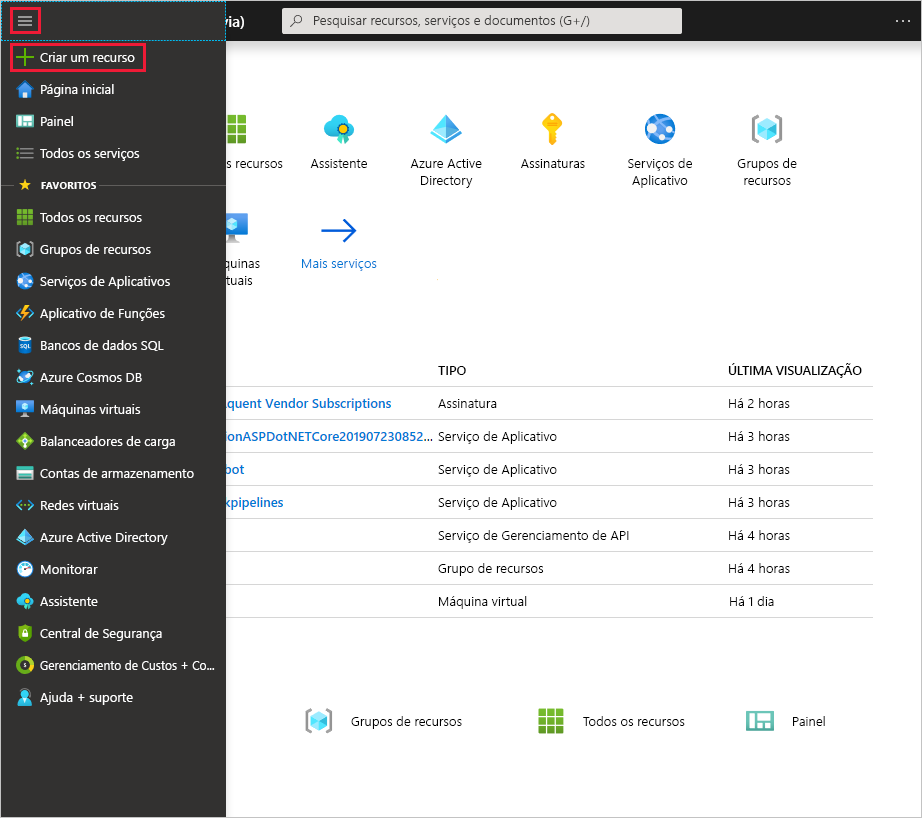

1. No menu [portal do Azure](https://portal.azure.com) , selecione **criar um recurso**. 

   
2. No campo **Pesquisar no Marketplace** , digite "gateway de rede virtual". Localize **Gateway de rede virtual** na pesquisa, retorne e clique na entrada. Na página **Gateway de rede virtual** , clique em **criar**. Isso abre a página **Criar gateway de rede virtual**.

   

   
3. Na página **Criar gateway de rede virtual**, preencha os valores para seu gateway de rede virtual.

   **Detalhes do projeto**

   - **Assinatura**: selecione a assinatura que você deseja usar na lista suspensa.
   - **Grupo de recursos**: essa configuração é preenchida automática quando você seleciona sua rede virtual nesta página.

   **Detalhes da instância**

   - **Nome**: nomeie o seu gateway. Nomear seu gateway não é o mesmo que nomear uma sub-rede de gateway. É o nome do objeto de gateway que você está criando.
   - **Região**: selecione a região na qual você deseja criar esse recurso. A região do gateway deve ser a mesma que a rede virtual.
   - **Tipo de gateway**: selecione **VPN**. Gateways VPN usam o tipo de gateway de rede virtual do tipo **VPN**. 
   - **Tipo de VPN**: selecione o Tipo de VPN especificado para sua configuração. A maioria das configurações exige um tipo de VPN baseado em rota.
   - **SKU**: selecione o SKU de gateway no menu suspenso. As SKUs listadas na lista suspensa dependem do tipo de VPN selecionado. Para saber mais sobre os SKUs de gateway, consulte [SKUs de Gateway](../articles/vpn-gateway/vpn-gateway-about-vpn-gateway-settings.md#gwsku).

      **Rede virtual**: escolha a rede virtual à qual você deseja adicionar este gateway.

      **Intervalo de endereços de sub-rede de gateway**: esse campo só aparecerá se a VNet não tiver uma sub-rede de gateway. Se possível, torne o intervalo/27 ou maior (/26,/25 etc.). Não é recomendável criar um intervalo menor que/28. Se você já tiver uma sub-rede de gateway, poderá exibir detalhes do GatewaySubnet navegando até sua rede virtual. Clique em **sub-redes** para exibir o intervalo. Se você quiser alterar o intervalo, poderá excluir e recriar o GatewaySubnet.

   **Endereço IP público**: essa configuração especifica o objeto de endereço IP público associado ao gateway da VPN. O endereço IP público é atribuído dinamicamente a esse objeto quando o gateway de VPN é criado. A única vez em que o endereço IP Público é alterado é quando o gateway é excluído e recriado. Isso não altera o redimensionamento, a redefinição ou outras manutenções/atualizações internas do seu gateway de VPN.

     - **Endereço IP público**: deixe **criar novo** selecionado.
     - **Nome do endereço IP público**: na caixa de texto, digite um nome para sua instância de endereço IP público.
     - **Atribuição**: o gateway de VPN dá suporte apenas ao dinâmico.

   **Modo ativo-ativo**: selecione somente **habilitar modo ativo-ativo** se você estiver criando uma configuração de gateway ativo-ativo. Caso contrário, deixe essa configuração não selecionado.

   Deixe **Configurar BGN ASN** desmarcado, a menos que sua configuração exija especificamente essa configuração. Se você precisar dessa configuração, o ASN padrão será 65515, embora isso possa ser alterado.

4. Clique em **examinar + criar** para executar a validação. Depois que a validação for aprovada, clique em **criar** para implantar o gateway de VPN. Um gateway pode levar até 45 minutos para criar e implantar totalmente. Você pode ver o status da implantação na página Visão geral do seu gateway.

Depois de criar o gateway você pode exibir, observando a Rede Virtual no portal, o endereço IP que foi atribuído a esse gateway. O gateway aparecerá como um dispositivo conectado.
