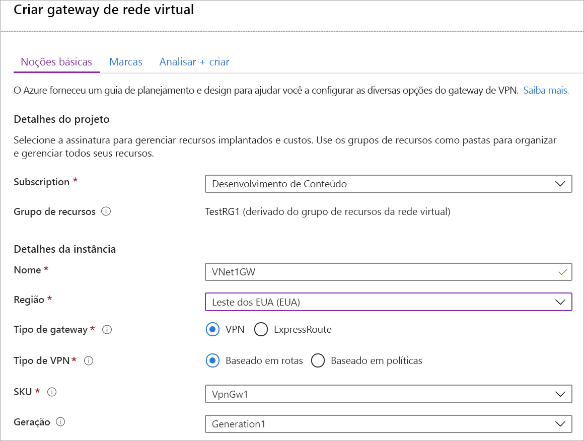
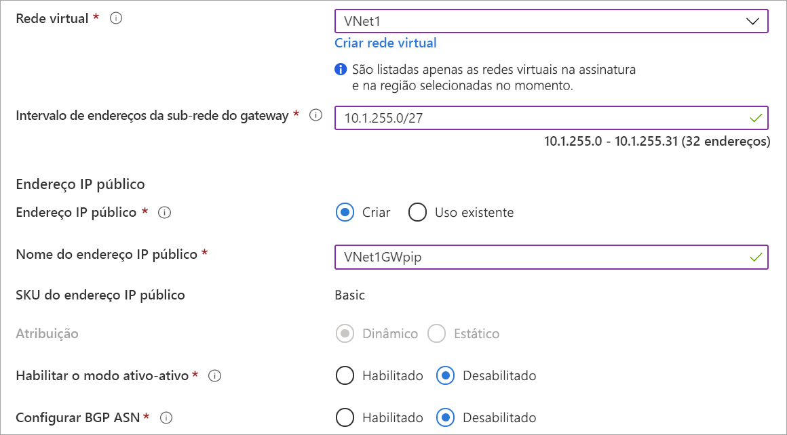

1. No menu [portal Do Azure,](https://portal.azure.com) selecione **Criar um recurso**. 

   
2. No **campo Pesquisar o Mercado,** digite 'Virtual Network Gateway'. Localize **o gateway de rede virtual** no retorno da pesquisa e selecione a entrada. Na página **de gateway de rede Virtual,** selecione **Criar**. Isso abre a página **Criar gateway de rede virtual**.
3. Na guia **Noções Básicas,** preencha os valores do gateway de rede virtual.

   

   

   **Detalhes do projeto**

   - **Assinatura**: Selecione a assinatura que deseja usar a partir da isento.
   - **Grupo de recursos**: Esta configuração é preenchida automaticamente quando você seleciona sua rede virtual nesta página.

   **Detalhes de instância**

   - **Nome**: nomeie o seu gateway. Nomear seu gateway não é o mesmo que nomear uma sub-rede de gateway. É o nome do objeto de gateway que você está criando.
   - **Região**: Selecione a região em que deseja criar esse recurso. A região para o gateway deve ser a mesma da rede virtual.
   - **Tipo de gateway**: selecione **VPN**. Gateways VPN usam o tipo de gateway de rede virtual do tipo **VPN**.
   - **Tipo de VPN**: selecione o Tipo de VPN especificado para sua configuração. A maioria das configurações exige um tipo de VPN baseado em rota.
   - **SKU**: selecione o SKU de gateway no menu suspenso. As SKUs listadas na lista suspensa dependem do tipo de VPN selecionado. Para saber mais sobre os SKUs de gateway, consulte [SKUs de Gateway](../articles/vpn-gateway/vpn-gateway-about-vpn-gateway-settings.md#gwsku).
   - **Geração**: Para obter informações sobre a geração de gatewayvpn VPN, consulte [Gateway SKUs](../articles/vpn-gateway/vpn-gateway-about-vpngateways.md#gwsku).
   - **Rede virtual**: A partir do dropdown, selecione a rede virtual à qual deseja adicionar este gateway.
   - **Intervalo de endereço da sub-rede gateway**: Este campo só aparece se o vnet não tiver uma sub-rede de gateway. Se possível, faça o intervalo /27 ou maior (/26,/25 etc.). Não recomendamos criar um intervalo menor que 28. Se você já tem uma sub-rede de gateway, você pode visualizar os detalhes do GatewaySubnet navegando para sua rede virtual. Clique **em Subredes** para ver o intervalo. Se você quiser alterar o intervalo, você pode excluir e recriar a GatewaySubnet.

   **Endereço IP público**: essa configuração especifica o objeto de endereço IP público associado ao gateway da VPN. O endereço IP público é atribuído dinamicamente a esse objeto quando o gateway de VPN é criado. A única vez em que o endereço IP Público é alterado é quando o gateway é excluído e recriado. Isso não altera o redimensionamento, a redefinição ou outras manutenções/atualizações internas do seu gateway de VPN.

     - **Endereço IP público :** Deixar **Criar novos** selecionados.
     - **Nome do endereço IP público**: Na caixa de texto, digite um nome para a instância pública do endereço IP.
     - **Atribuição**: o gateway VPN suporta apenas o Dynamic.

   **Modo ativo:** Apenas **selecione Habilitar modo ativo se** você estiver criando uma configuração de gateway ativo. Caso contrário, deixe essa configuração não selecionado.

   Deixe **Configurar BGN ASN** desmarcado, a menos que sua configuração exija especificamente essa configuração. Se você precisar dessa configuração, o ASN padrão será 65515, embora isso possa ser alterado.
4. Selecione **'Revisar + criar** para executar a validação'. Uma vez que a validação passe, selecione **Criar** para implantar o gateway VPN. Um gateway pode levar até 45 minutos para criar e implantar totalmente. Você pode ver o status de implantação na página Visão geral do seu gateway.

Depois de criar o gateway você pode exibir, observando a Rede Virtual no portal, o endereço IP que foi atribuído a esse gateway. O gateway aparecerá como um dispositivo conectado.
