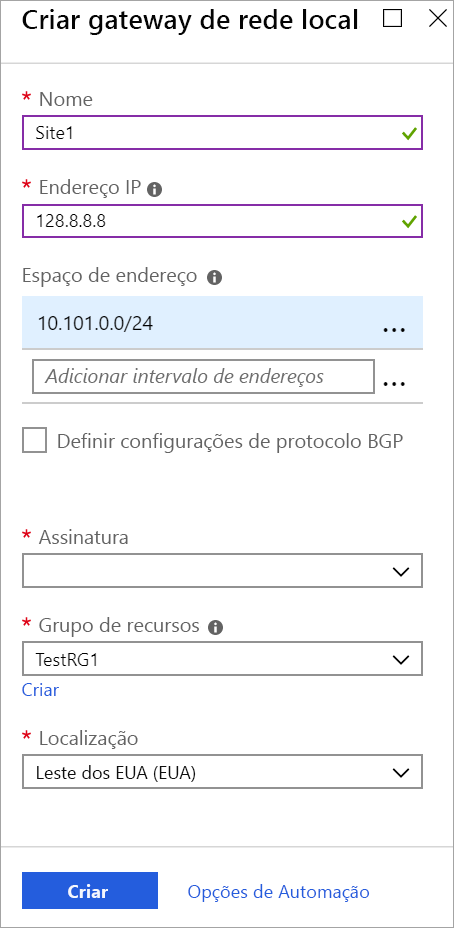

1. No menu do [portal do Azure](https://portal.azure.com), selecione **Criar um recurso**. 

   
2. No campo **Pesquisar o marketplace**, digite **Gateway de rede local** e, em seguida, pressione **Enter** para pesquisar. Isso retornará uma lista de resultados. Clique em **Gateway de rede local**, depois clique no botão **Criar** para abrir a página **Criar gateway de rede local**.

   

3. Na **página Criar gateway de rede local**, especifique os valores para seu objeto de gateway de rede local.

   - **Nome:** especifique um nome para seu objeto de gateway de rede local.
   - **Endereço IP:** este é o endereço IP público do dispositivo VPN ao qual você deseja que o Azure se conecte. Especifique um endereço IP público válido. Se você não tiver o endereço IP no momento, poderá usar os valores mostrados no exemplo, mas precisará voltar e substituir o seu endereço IP de espaço reservado com o endereço IP público de seu dispositivo VPN. Caso contrário, o Azure não será capaz de se conectar.
   - **Espaço de Endereço** refere-se aos intervalos de endereços para a rede que o objeto de rede local representa (a sua rede local). Você adiciona os espaços de endereço que deseja rotear para a sua rede local. Você pode adicionar vários intervalos de espaço de endereço. Verifique se os intervalos que você especifica aqui não se sobrepõem aos intervalos de outras redes com que você deseja se conectar. O Azure roteará o intervalo de endereços especificado para o endereço IP do dispositivo VPN local. *Se deseja se conectar ao site local, use seus próprios valores aqui, e não os valores mostrados no exemplo*.
   - **Configurar as definições de BGP ASN**: Use somente ao configurar o BGP. Caso contrário, não selecione essa opção.
   - **Assinatura:** Verifique se a assinatura correta está sendo exibida.
   - **Grupo de recursos:** Selecione o grupo de recursos que você deseja usar. Você pode criar um novo grupo de recursos ou selecionar um que você já criou.
   - **Localização:** a localização é a mesma que a **Região** em outras configurações. Selecione o local em que esse objeto será criado. Você pode querer selecionar o mesmo local onde reside a sua rede virtual, mas não é necessário fazê-lo.

4. Ao terminar de especificar os valores, clique no botão **Criar**, na parte inferior da página, para criar o gateway de rede local.
