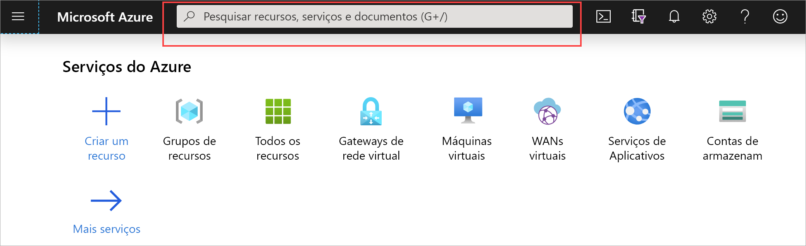
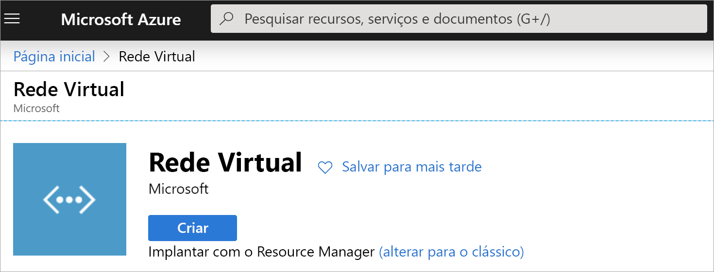
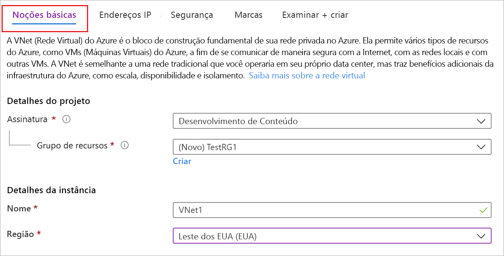
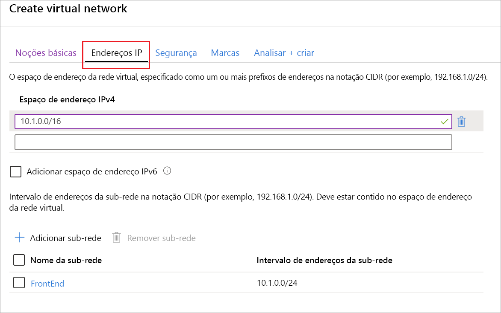

1. Entre no [portal do Azure](https://portal.azure.com).
1. Em **Pesquisar recursos, serviço e documentos (G+/)** , digite *rede virtual*.

   
1. Selecione **Rede Virtual** nos resultados do **Marketplace**.

   
1. Na página **Rede Virtual**, selecione **Criar**.

   
1. Depois que você selecionar, **Criar**, a página **Criar rede virtual** será aberta.
1. Na guia **Básico**, configure os **Detalhes do projeto** e as definições de VNet dos **Detalhes da instância**.

    Quando você preencher os campos, verá a marca de seleção verde quando os caracteres inseridos no campo forem validados. Alguns valores são preenchidos automaticamente, que podem ser substituídos por seus próprios valores:

   - **Assinatura**: verifique se a assinatura listada é a correta. Você pode alterar as assinaturas usando o menu suspenso.
   - **Grupo de recursos**: Selecione um grupo de recursos ou clique em **Criar** para criar um. Para saber mais sobre os grupos de recursos, confira [Visão geral do Azure Resource Manager](../articles/azure-resource-manager/management/overview.md#resource-groups).
   - **Name**: insira o nome de sua rede virtual.
   - **Região**: selecione a localização de sua VNet. A localização determina onde ficarão os recursos que você implanta nessa rede virtual.

1. Na guia **endereços IP**, configure os valores. Os valores mostrados nos exemplos a seguir servem para fins de demonstração. Ajuste esses valores de acordo com as configurações que você precisa.

     
   - **Espaço de endereço IPv4**: por padrão, um espaço de endereço é criado automaticamente. Você pode clicar no espaço de endereço para ajustá-lo a fim de refletir seus valores. Também é possível adicionar outros espaços de endereço.
   - **Sub-rede**: se você usar o espaço de endereço padrão, uma sub-rede padrão será criada automaticamente. Se você alterar o espaço de endereço, precisará adicionar uma sub-rede. Selecione **+ Adicionar sub-rede** para abrir a janela **Adicionar sub-rede**. Defina as seguintes configurações e selecione **Adicionar** para adicionar os valores:
      - **Nome da sub-rede**: neste exemplo, nomeamos a sub-rede "FrontEnd".
      - **Intervalo de endereços da sub-rede**: o intervalo de endereços para esta sub-rede.

1. Na guia **Segurança**, neste momento, deixe os valores padrão:

   - **Proteção contra DDoS**: Basic
   - **Firewall**: Desabilitado
1. Selecione **Examinar + criar** para validar as configurações de rede virtual.
1. Depois que as configurações forem validadas, selecione **Criar**.
