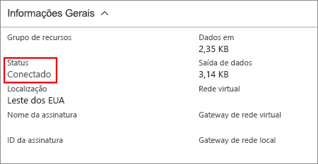

No portal do Azure, você pode exibir o status da conexão de um Gateway de VPN do Resource Manager navegando até a conexão. As etapas a seguir mostram uma maneira de navegar para a conexão e verificar.

1. No menu do [portal do Azure](https://portal.azure.com), selecione **Todos os recursos** ou pesquise e selecione **Todos os recursos** de uma página específica. 
2. Selecione para o gateway de rede virtual.
3. Na folha do gateway de rede virtual, clique em **Conexões**. Você pode ver o status de cada conexão.
4. Clique no nome da conexão que você deseja verificar para abrir **Essentials**. No Essentials, você pode exibir mais informações sobre a conexão. O **Status** será 'Êxito' e 'Conectado' quando você tiver feito uma conexão bem-sucedida.

   
